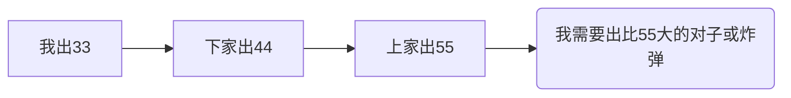

# 一个斗地主人工智能的设计与实现

## 1 绪论（10%）

本章主要介绍牌类游戏的人工智能领域研究工作，分为三节：第一节介绍研究背景，主要描述牌类游戏人工智能研究现状；第二节主要介绍博弈树技术相关的研究现状，包括对博弈树框架的介绍、对博弈树搜索算法的优化方法的介绍；第三节总结前面提到方法的关键研究点，提出本系统设计思路和实现方法。

### 1.1 研究背景

本节主要介绍系统的研究背景与意义，主要从以下两个方面来说明：一是游戏AI在实际应用中与人对战的人类需求；二是说明博弈人工智能技术的发展对其他实际问题的研究启示，应用到股票、交通等领域的实际需求。

### 1.2 国内外研究概况

本节主要介绍博弈树人工智能相关概念，介绍人工智能技术的分类及发展历史，介绍博弈树算法及其优化算法，介绍国内外对牌类游戏人工智能的研究现状。

### 1.3 论文主要工作

## 2 游戏主体设计（40%）

### 2.1 设计目标

本系统的设计目标是设计一个斗地主的人工智能系统，它可以代替人玩斗地主游戏。它可以接入网络斗地主游戏和人一起玩斗地主。

### 2.2 设计思路

想让机器像人一样打斗地主主要有以下两种设计思路：一是让机器学会打牌的逻辑，让机器知道什么样的牌能打，什么样的不能打，让他知道什么时候游戏结束，谁赢了，让他知道现在他手上的牌是好是坏。这样，利用计算机高速计算的优点，可以用比人脑快得多的速度预测未来几轮出牌的走势，从中选取一个对自己最有利的作为本次出牌策略。第二种设计思路是基于仿生学建立起来的。人类从呱呱坠地到会打斗地主游戏经历了学习的过程，人类学习认识不同扑克牌表示的不同含义，人类通过学习学会斗地主的游戏规则，人类通过学习提高自己的打牌水平。人在打斗地主游戏时，不断观察自己的手牌和已出的手牌，判断当前局势并选取对自己最有利的出法出牌。类比到计算机上，让计算机了解出牌规则，把当前手牌和已出牌作为输入，当前局势作为输入，以赢得游戏为目的，把本轮出牌作为输出，利用大量牌局训练计算机，最终让计算机自己学会玩斗地主。本系统采用的是第一种设计思路。

### 2.3 工作原理

输入当前手牌，让计算机将这些手牌拆分成所有可出的情况，然后将当前情况作为根节点，以每种可能的出牌情况作为子节点，每个子节点代表从当前节点，出了这种牌以后牌局的状态。对于根节点的每个子节点，都在根节点下面一层，因此可以将它们称为第一层节点。第一层的每一个节点都可以看成根节点，再进行展开，从而得到一棵完整的，代表牌局未来每一个状态的博弈树。博弈树展开到最后会得出游戏结果，农民或地主会取得游戏的胜利，此状态对应的节点为博弈树的叶子节点。博弈树完全展开后，每个叶子节点对应农民或地主的某一方取得了游戏的胜利。节点和节点之间的路径可以看作父节点的出牌选择。假设某一分支的叶子节点k在第m层，此叶子节点对应的胜利玩家是a，a在第m-1层的，k节点的父节点（k-1）一定会选择通向胜利的（k）来作为他的选择，如果他不那样选，选择其他出牌方法都对自己不利，这是显而易见的。因此我们可以认为，对于轮到a出牌的节点k-1，一定意味着a胜利。逐层向上回写，可以得到根节点root对应的所有节点的胜负情况。==如果有多个分支通往胜利怎么办？如果没有怎么办？==这时可以选取通往胜利的节点。

但在实际情况中，如果每次有m种出牌方法，共有f层节点，整个博弈树就有==？？？==个节点，因此建立完整个博弈树往往是不可能的。但是不建立完博弈树，就得不到最终的结果。因此这里用到评估函数。评估函数顾名思义，意思是评估一个状态的优劣。以斗地主为例，在一局游戏没有进行到最后的时候，用评估函数来计算当前状态的好坏。以此给博弈树中的所有节点状态打分。因为上文提到的原因无法完全遍历博弈树，只能将博弈树展开到一定层次，用评估函数来给最后一层的节点及其他层的叶子节点状态打分，认为分数越高越容易赢。再用极大极小算法层层回写，找出最容易赢的选择。

### 2.4 模块构成

本系统由30个函数构成。

- [x] findfirst
- [x] findshun
- [x] findxdx
- [x] findfzji
- [ ] display
- [ ] randomcard
- [x] chaipai
- [x] checkhandsdict
- [ ] isend
- [ ] sumofcards
- [ ] isbigger
- [ ] hvfu
- [ ] gen_game_tree
- [ ] keiu
- [ ] judge
- [ ] judge_tree
- [x] svbmiu
- [x] gfpl
- [ ] shoudong
- [ ] inputcards
- [ ] sumof
- [ ] svjipl
- [ ] update
- [x] initcards
- [ ] fanyi
- [x] zidong
- [ ] randomtest
- [ ] aipush
- [ ] show
- [ ] test

下面按流程介绍。

先介绍打牌系统。打牌系统主要为zidong()函数。伪代码如下：

```python
def zidong():
    # 输入手牌-计算剩余牌
    # 出牌-输入别人出牌-更新剩余牌
    global sigbb
    sigbb = input("谁是地主1-我/2-下家/3-上家")
    if sigbb == "1":
        mnum = 20  # 手牌计数器
        nnum = 17
        lnum = 17
        loop = 0
    elif sigbb == "2":
        mnum = 17  # 手牌计数器
        nnum = 20
        lnum = 17
        loop = 1
    else:
        mnum = 17  # 手牌计数器
        nnum = 17
        lnum = 20
        loop = 2
    ijb = 999  # 控制是否随便出
    handc, lastc = initcards()
    print("initcards", handc, lastc)
    # 手牌 剩余牌ready
    odc = [0, 0, 0, 0, 0, 0, 0, 0, 0, 0, 0, 0, 0, 0, 0]
    while True:
        if loop % 3 == 0:  # my turn
            iupllist = []
            for i in range(MTTIMES):
                nhand, lhand = svjipl(lastc, nnum, lnum)  # 随机一个下家和上家的手牌
                print("svjipl", nhand, lhand)
                # 现在有三家的牌了 可以算了
                if ijb > 1:
                    iupltype, iuplvalue = svbmiu(handc, nhand, lhand)
                    print("svbmiu", iupltype, iuplvalue)
                else:
                    print("odc", odc)
                    iupltype, iuplvalue = gfpl(odc, handc, nhand, lhand)
                    print("gfpl", iupltype, iuplvalue)
                iupllist.append((iupltype, iuplvalue))
            print("iupllist", iupllist)
            iupl, times = Counter(iupllist).most_common(1)[0]
            print("most_common", iupl)
            # 然后更新牌库
            handc, mnum = update(iupl[0], iupl[1], handc, mnum)
            print("update", handc, mnum)
            iuplstr = fanyi(iupl[0], iupl[1])
            print("********************************出牌", iuplstr, "********************************")
        elif loop % 3 == 1:  # 下家
            lastc, odc, ijb, nnum = inputcards(lastc, ijb, nnum, odc)
            print("inputcards", lastc, odc, ijb, nnum)
        else:  # 上家
            lastc, odc, ijb, lnum = inputcards(lastc, ijb, lnum, odc)
            print("inputcards", lastc, odc, ijb, lnum)
        print("===========================================================================")
        loop += 1

```


我使用手机游戏“腾讯欢乐斗地主”，开始一局新游戏，并开始运行zidong()函数。sigbb用来存储谁是地主。initcards()函数初始化手牌和剩余牌。initcards()代码如下：

```python
def initcards():
    '''
    :return:手牌 剩余牌
    '''
    str = input("请输入手牌 格式为34567890jqka2xd")
    strdict = {"3": 0, "4": 1, "5": 2, "6": 3, "7": 4, "8": 5, "9": 6, "0": 7, "j": 8, "q": 9, "k": 10, "a": 11,
               "2": 12, "x": 13, "d": 14}
    handc = [0, 0, 0, 0, 0, 0, 0, 0, 0, 0, 0, 0, 0, 0, 0]
    allc = [4, 4, 4, 4, 4, 4, 4, 4, 4, 4, 4, 4, 4, 1, 1]
    for i in range(len(str)):
        handc[strdict[str[i]]] += 1
    lastc = list(map(lambda x: x[0] - x[1], zip(allc, handc)))
    return handc, lastc

```

欢乐斗地主发给我一副手牌，在initcards函数中将手牌写入str中，输入格式为：3 4 5 6 7 8 9 10 J Q K A 2 小王 大王分别对应'3''4''5''6''7''8''9''0''j''q''k''a''2''x''d'。程序内使用列表存储手牌，例如表示全部54张牌：examplelist= [4, 4, 4, 4, 4, 4, 4, 4, 4, 4, 4, 4, 4, 1, 1] examplelist[0]表示扑克牌3 4表示这张3有4张。顺序为列表元素从0-14分别代表3 4 5 6 7 8 9 10 J Q K A 2 小王 大王。再如某手牌为handc = [2, 2, 0, 0, 0, 0, 0, 0, 0, 0, 0, 0, 0, 1, 0]，则代表此人有两张3 两张4 和一张小王。表格说明如下：

| 手牌 | 对应输入字符 | 对应列表序列数 |
| ---- | ------------ | -------------- |
| 3    | 3            | 0              |
| 4    | 4            | 1              |
| 5    | 5            | 2              |
| 6    | 6            | 3              |
| 7    | 7            | 4              |
| 8    | 8            | 5              |
| 9    | 9            | 6              |
| 10   | 0            | 7              |
| J    | j            | 8              |
| Q    | q            | 9              |
| K    | k            | 10             |
| A    | a            | 11             |
| 2    | 2            | 12             |
| 小王 | x            | 13             |
| 大王 | d            | 14             |

输入完手牌以后，利用循环把手牌转换为列表，存储到handc列表中，再用全部牌按元素相减，得到剩余牌并返回。接下来，在zidong函数中，进入while循环，用loop%3来判断该谁出牌。例如sigbb为1的时候，loop初值为0，那么loop%3也为0，系统就知道是该我出牌了，每轮出牌后，都执行loop=loop+1的操作，因此系统可以让我、下家、上家轮流出牌。在轮到我出牌时，使用svbmiu和gfpl两个函数出牌。介绍这两个函数前先要介绍ijb变量。ijb用于控制电脑确认是否可以随便出牌。例如下图流程：



上家出了55，我需要出比55大的牌（比55大的对子或炸弹）。但如果是这种情况：


下家、上家都没有出牌，因此我可以出任意牌型。我使用ijb变量判断每种情况。ijb初值设一个很大的值（如999），每当有人出牌了，就将它设为0，每当有人没出牌就让它加1。只有我出了牌，下家、上家均pass时我才随便出，因此ijb>=2的时候我可以随便出牌。如果ijb为0或者1代表上家或下家出过牌，需要我跟牌。随便出的函数为svbmiu（随便出的搜狗双拼，下同），跟牌的函数名为gfpl。

svbmiu接收3个参数，分别是我的手牌、下家的手牌和上家的手牌。而斗地主作为非完全博弈，电脑是不知道其他玩家有什么牌的。但是扑克牌一共有54张，每回合每个人出了哪些牌都是确定的，因此知道其他两名玩家分别有几张牌，也知道其他两名玩家手里一共有哪些牌。但是建立博弈树需要知道每名玩家的牌，这里用到了==蒙特卡洛==随机算法。==可补充==使用svjipl函数输入剩余牌列表，输入下家和上家的手牌，返回一个随机的牌组结果。例如剩余牌列表为[2, 3, 1, 0, 0, 0, 0, 0, 0, 0, 0, 0, 0, 0, 0]，下家剩余3张牌，上家剩余3张牌，一个随机的牌组结果为下家[1, 2, 0, 0, 0, 0, 0, 0, 0, 0, 0, 0, 0, 0, 0]，上家[1, 1, 1, 0, 0, 0, 0, 0, 0, 0, 0, 0, 0, 0, 0]。利用这个随机的牌组结果计算后文的出牌函数，得到最佳出牌结果，重复随机多次，选出出现次数最多的出牌作为最后决策。如某局游戏中，设定重复随机10次，最终计算得到的出牌结果列表如下：["出33","出33","出33","出33","出33","出44","出55","出66","不出","出33"]，则选择出现次数最多的"出33"作为最后决策。

svjipl函数使用random包中的sample函数，假设下家剩余m张手牌，则从剩余牌中任选m个作为下家手牌，其余牌作为上家手牌。

至此，已经有了三家手牌，可以出牌了。下面介绍两个出牌函数：svbmiu函数和gfpl函数。svbmiu函数输入三家手牌。

下面建立博弈树根节点，


出牌先要知道可以出什么牌。0 1 2 3 4格式存储的手牌先要使用chaipai函数拆牌，转换为其他形式。这里使用了字典里嵌套列表的形式，比如某次拆牌的结果：

```python
{'djvh': [0, 1, 2, 3, 4, 5, 6, 7, 9, 10, 12], 
 'dvzi': [1, 2, 4, 5, 6, 7, 9], 
 'sjvh': [6, 9], 
 'vadj': [], 
 'upzi': [(0, 4), (0, 5), (0, 6), (0, 7)], 
 'lmdv': [(4, 6), (4, 7)], 
 'sjlm': [], 
 'silm': [], 
 'sjdlyi': [(6, 0), (6, 1), (6, 2), (6, 3), (6, 4), (6, 5), (6, 7), (6, 9), (6, 10), (6, 12), (9, 0), (9, 1), (9, 2), (9, 3), (9, 4), (9, 5), (9, 6), (9, 7), (9, 10), (9, 12)], 
 'sjdlor': [(6, 1), (6, 2), (6, 4), (6, 5), (6, 7), (6, 9), (9, 1), (9, 2), (9, 4), (9, 5), (9, 6), (9, 7)], 
 'sidlor': [], 
 'sidllddv': [], 
 'orlmfzji': [], 
 'orlmfzji2': [], 
 'sjlmfzji': [], 
 'sjlmfzji2': [], 
 'silmfzji': [], 
 'silmfzji2': [], 
 'wulmfzji': [], 
 'hhtmfzji': [], 
 'hhtmfzji2': [], 
 'hhtmfzji3': []}
```

我的手牌为[1, 2, 2, 1, 2, 2, 3, 2, 0, 3, 1, 0, 1, 0, 0]，字典关键字与牌型的关系见下表：

| 关键字    | 牌型         | 牌型举例                       |
| --------- | ------------ | ------------------------------ |
| djvh      | 单张         | 3                              |
| dvzi      | 对子         | 33                             |
| sjvh      | 三张         | 333                            |
| vadj      | 炸弹         | 3333、4444或王炸（大王、小王） |
| upzi      | 顺子         | 34567                          |
| lmdv      | 连对         | 334455                         |
| sjlm      | 三连         | 333444                         |
| silm      | 四连         | 33334444                       |
| sjdlyi    | 三带一       | 3334                           |
| sjdlor    | 三带二       | 33344                          |
| sidlor    | 四带二       | 3333 45                        |
| sidllddv  | 四带两对     | 3333 4455                      |
| orlmfzji  | 二连飞机     | 333444 56                      |
| orlmfzji2 | 二连飞机对子 | 333444 5566                    |
| sjlmfzji  | 三连飞机     | 333444555 678                  |
| sjlmfzji2 | 三连飞机对子 | 333444555 667788               |
| silmfzji  | 四连飞机     | 333444555666 789Q              |
| silmfzji2 | 四连飞机对子 | 333444555666 778899QQ          |
| wulmfzji  | 五连飞机     | 333444555666777 89QKA          |
| hhtmfzji  | 航天飞机     | 33334444 5678                  |
| hhtmfzji2 | 航天飞机对子 | 33334444 55667788              |
| hhtmfzji3 | 三连航天飞机 | 333344445555 6789QK            |

例如djvh对应的列表里包含0，依据前表的对应关系，说明可以出单张3。再如sjdlyi对应的列表里包含(6,0)，说明可以出三带一9993。

下面介绍拆牌函数。观察斗地主游戏中允许出的所有情况，分析得知可出牌的元素有四种，分别是：单张、对子、三张和四张。比如连对334455，由对3、对4和对5组成。再如二连飞机33344456，由三张3、三张4、单张5和单张6组成。因此想拆牌，先拆出4种元素。为了拆出四种元素，定义了findfirst函数。findfirst函数输入手牌，元素数，返回这种元素列表。findfirst(handc,2)则返回了handc中所有的对子。返回结果为```[1, 2, 4, 5, 6, 7, 9]```。元素列表建立完成以后开始找顺子。findshun函数用于找顺子；findxdx函数用于找三带一、三带二等；findfzji函数用于找飞机。这些函数均使用元素拼接，加入到不同列表里返回，在此不一一赘述。

chaipai函数返回的结果包含许多空项，使用checkhandsdict函数来把他们去掉。下面是去掉后的结果：


```python
{'djvh': [0, 1, 2, 3, 4, 5, 6, 7, 9, 10, 12], 
 'dvzi': [1, 2, 4, 5, 6, 7, 9], 
 'sjvh': [6, 9], 
 'upzi': [(0, 4), (0, 5), (0, 6), (0, 7)], 
 'lmdv': [(4, 6), (4, 7)], 
 'sjdlyi': [(6, 0), (6, 1), (6, 2), (6, 3), (6, 4), (6, 5), (6, 7), (6, 9), (6, 10), (6, 12), (9, 0), (9, 1), (9, 2), (9, 3), (9, 4), (9, 5), (9, 6), (9, 7), (9, 10), (9, 12)], 
 'sjdlor': [(6, 1), (6, 2), (6, 4), (6, 5), (6, 7), (6, 9), (9, 1), (9, 2), (9, 4), (9, 5), (9, 6), (9, 7)]}
```

至此，pushcarddict里包含所有可以出的情况。


### 2.5 数据结构

本章主要介绍系统的主体设计方法。分为三个部分：第一部分介绍系统使用的数据结构以及数据结构的设计思路；第二部分介绍本系统的总体流程设计；第三部分具体介绍人工智能模块的设计思路和方法，详细描述机器的出牌策略与实现方法。


本节主要介绍本系统的设计所用算法，概述设计思路，简单介绍系统框架。


## 3 游戏AI关键算法设计（30%）

本节详细介绍人工智能模块设计思路、算法及实现。第一部分介绍博弈树的建立与手牌的拆分；第二部分介绍评估函数的设计与实现；第三部分介绍搜索算法设计与实现；第四部分介绍搜索算法的优化。

### 3.1 博弈树的建立

### 3.2 评估函数设计

### 3.3 搜索算法设计

本部分介绍多种搜索算法，并着重介绍本系统采用的算法。

### 3.4 搜索算法的优化

## 4 游戏AI的实际对战实验（15%）

本章主要介绍系统在实际对战中的运行情况，分别与普通人类玩家和随机出牌电脑对弈，通过实验得出本系统的实战水平，并做进一步优缺点分析评估。

### 4.1 实验环境

### 4.2 实验结果

### 4.3 实验总结

## 5 总结与展望（5%）

本章总结全文，主要从系统设计、系统实现及实战结果三个方面总结系统的优势和不足，并针对不足提出今后的研究方向。

### 5.1 全文总结

### 5.2 展望

不足 没有剪枝 

博弈树没有重用

非地主情况需要优化


## 致谢

## 参考文献

代码：

```python
# -*- coding=utf-8 -*-
import matplotlib
matplotlib.use('Agg')
import copy
import itertools
import random
import sys
from collections import Counter

# global sigb  # 谁是地主
# sigb = 1

DEBUG0 = 0
MAXLEVEL = 3
MTTIMES = 1
MAXTS = 1000


class DTree(object):
    def __init__(self, iupltype, iuplvalue, ugyupl, player, value=-1, buiu=0, level=0, score=0):
        self.iupltype = iupltype
        self.iuplvalue = iuplvalue
        self.ugyupl = ugyupl
        self.player = player
        self.value = value
        self.buiu = buiu
        self.level = level
        self.nodes = []
        self.score = score

    def addNode(self, iupltype, iuplvalue, ugyupl, player, value=-1, buiu=0, level=0):
        if buiu > 2:
            return
        if level >= MAXLEVEL or value != -1:
            score = judge(ugyupl[0])
        else:
            score = -1
        # print("\n{{出牌", iupltype, iuplvalue,
        #       "\n{{剩余牌", ugyupl,
        #       "\n{{player value buiu", player, value, buiu,
        #       "\n{{level", level,
        #       "\n{{score", score)
        node = DTree(iupltype, iuplvalue, ugyupl, player, value, buiu, level, score)
        self.nodes.append(node)
        return


def findfirst(handcards, num):
    listtoappend = []
    for i in range(len(handcards)):
        if handcards[i] >= num:
            listtoappend.append(1)
        else:
            listtoappend.append(0)
    return listtoappend


def findshun(find, findlist):
    # 函数说明
    # find 找几个 单顺就是5 连对就是3
    # findlist 从哪找 单顺就是dj 连对就是dv
    # listtoappend 结果保存list
    left = 0
    #    right = 0
    listtoappend = []
    for i in range(15):
        if findlist[i] == 0:
            continue
        elif findlist[i] == 1:
            if i == 0 or findlist[i - 1] == 0:
                left = i
            else:
                right = i
                if right - left > find - 2:
                    # 组成顺子 加到顺子列表里
                    if right < 12:
                        listtoappend.append((left, right))
        else:
            print("Wrong!")
            exit(-1)
    return listtoappend


def findxdx(a, b, m):
    '''
    :param a: 带list
    :param b: 被带list
    :param m: 带几张
    :return: 带好的list
    '''
    temp = []
    for i in range(15):
        if b[i] == 1:
            temp.append(i)  # 可以带的list
    if m > 1:
        temp = list(itertools.combinations(temp, m))
    listtoappend = []
    for i in range(15):
        if a[i] == 1:  # 说明sj[i]可以带
            for ii in range(len(temp)):
                if m > 1:
                    ok = 1
                    for iii in range(len(temp[0])):
                        if temp[ii][iii] == i:
                            ok = 0
                else:
                    if temp[ii] != i:
                        ok = 1
                    else:
                        ok = 0
                if ok:
                    listtoappend.append((i, temp[ii]))
    return listtoappend


def findfzji(a, b, ln, rn):
    '''
    :param a: 带的list
    :param b: 被带的list
    :param ln: 带的数目
    :param rn: 被带的数目
    :return: 飞机list
    '''
    temp = []
    for i in range(len(a)):
        if a[i][1] - a[i][0] == ln - 1:
            temp.append(a[i])
    btemp = []
    for i in range(15):
        if b[i] == 1:
            btemp.append(i)  # 可以带的list
    btemp = list(itertools.combinations(btemp, rn))
    listtoappend = []
    for i in range(len(temp)):
        for ii in range(len(btemp)):
            ok = 1
            for iii in range(rn):
                if temp[i][0] <= btemp[ii][iii] <= temp[i][1]:
                    ok = 0
            if ok:
                listtoappend.append((temp[i], btemp[ii]))
    return listtoappend


def display(handcards, nhandcards, lhandcards):
    print("            3  4  5  6  7  8  9  10 J  Q  K  A  2 小王 大王")
    print("handcards:", handcards)
    print("nhandcards:", nhandcards)
    print("lhandcards:", lhandcards)
    return


def randomcard():
    handcards = [0, 0, 0, 0, 0, 0, 0, 0, 0, 0, 0, 0, 0, 0, 0]
    lhandcards = [0, 0, 0, 0, 0, 0, 0, 0, 0, 0, 0, 0, 0, 0, 0]
    nhandcards = [0, 0, 0, 0, 0, 0, 0, 0, 0, 0, 0, 0, 0, 0, 0]
    fcards = random.sample(range(54), 54)
    for m in range(54):
        if m < 17:
            if fcards[m] == 53:
                lhandcards[14] += 1
            else:
                lhandcards[fcards[m] // 4] += 1
        elif 17 <= m < 34:
            if fcards[m] == 53:
                nhandcards[14] += 1
            else:
                nhandcards[fcards[m] // 4] += 1
        else:
            if fcards[m] == 53:
                handcards[14] += 1
            else:
                handcards[fcards[m] // 4] += 1
    return handcards, nhandcards, lhandcards


def chaipai(handcards):
    # 拆牌
    dj = findfirst(handcards, 1)
    dv = findfirst(handcards, 2)
    sj = findfirst(handcards, 3)
    si = findfirst(handcards, 4)
    djvh = []
    dvzi = []
    sjvh = []
    vadj = []
    for i in range(15):
        if dj[i] == 1:
            djvh.append(i)
        if dv[i] == 1:
            dvzi.append(i)
        if sj[i] == 1:
            sjvh.append(i)
        if si[i] == 1:
            vadj.append(i)
    if dj[13] == 1 and dj[14] == 1:
        vadj.append(13)
    # 下面建立顺子列表 从单张列表里找到连续5个以上有值的
    upzi = findshun(5, dj)
    lmdv = findshun(3, dv)
    sjlm = findshun(2, sj)
    silm = findshun(2, si)
    # 下面建立x带x列表
    sjdlyi = findxdx(sj, dj, 1)
    sjdlor = findxdx(sj, dv, 1)
    sidlor = findxdx(si, dj, 2)
    sidllddv = findxdx(si, dv, 2)
    #  下面建立飞机列表
    orlmfzji = findfzji(sjlm, dj, 2, 2)
    orlmfzji2 = findfzji(sjlm, dv, 2, 2)
    sjlmfzji = findfzji(sjlm, dj, 3, 3)
    sjlmfzji2 = findfzji(sjlm, dv, 3, 3)
    silmfzji = findfzji(sjlm, dj, 4, 4)
    silmfzji2 = findfzji(sjlm, dv, 4, 4)
    wulmfzji = findfzji(sjlm, dj, 5, 5)
    hhtmfzji = findfzji(silm, dj, 2, 4)
    hhtmfzji3 = findfzji(silm, dj, 3, 6)
    hhtmfzji2 = findfzji(silm, dv, 2, 4)
    # 可出牌list建立完毕
    if DEBUG0:
        if djvh:
            print('单张', djvh)
        if dvzi:
            print('对子', dvzi)
        if sjvh:
            print('三张', sjvh)
        if vadj:
            print('炸弹', vadj)
        if upzi:
            print("顺子", upzi)
        if lmdv:
            print("连对", lmdv)
        if sjlm:
            print("三连", sjlm)
        if silm:
            print("四连", silm)
        if sjdlyi:
            print("三带一：", sjdlyi)
        if sjdlor:
            print("三带二：", sjdlor)
        if sidlor:
            print("四带二：", sidlor)
        if sidllddv:
            print("四带两对：", sidllddv)
        if orlmfzji:
            print("二连飞机", orlmfzji)
        if orlmfzji2:
            print("二连飞机 对", orlmfzji2)
        if sjlmfzji:
            print("三连飞机", sjlmfzji)
        if sjlmfzji2:
            print("三连飞机 对", sjlmfzji2)
        if silmfzji:
            print("四连飞机", silmfzji)
        if silmfzji2:
            print("四连飞机 对", silmfzji2)
        if wulmfzji:
            print("五连飞机", wulmfzji)
        if hhtmfzji:
            print("二连航天飞机", hhtmfzji)
        if hhtmfzji2:
            print("二连航天飞机 对", hhtmfzji2)
        if hhtmfzji3:
            print("三连航天飞机", hhtmfzji3)
    return {"djvh": djvh, "dvzi": dvzi, "sjvh": sjvh, "vadj": vadj, "upzi": upzi, "lmdv": lmdv, "sjlm": sjlm,
            "silm": silm, "sjdlyi": sjdlyi, "sjdlor": sjdlor, "sidlor": sidlor, "sidllddv": sidllddv,
            "orlmfzji": orlmfzji, "orlmfzji2": orlmfzji2, "sjlmfzji": sjlmfzji, "sjlmfzji2": sjlmfzji2,
            "silmfzji": silmfzji, "silmfzji2": silmfzji2, "wulmfzji": wulmfzji, "hhtmfzji": hhtmfzji,
            "hhtmfzji2": hhtmfzji2, "hhtmfzji3": hhtmfzji3}


def checkhandsdict(pushcarddict):  # 去掉空的项
    keydel = []
    for key in pushcarddict:
        if len(pushcarddict[key]) == 0:
            keydel.append(key)
    for i in keydel:
        pushcarddict.pop(i)
    return pushcarddict


def isend(handcards, nhandcards, lhandcards, sigbb=1):
    '''

    :param handcards:
    :param nhandcards:
    :param lhandcards:
    :param sigbb:    1   我是地主
                    2   下家是地主
                    3   上家是地主
    :return:    1   赢
                0   输
                -1  未完待续
    '''

    sig = 4

    sum = 0
    for i in range(14):
        sum += handcards[i]
    if sum == 0:
        sig = 1

    sum = 0
    for i in range(14):
        sum += nhandcards[i]
    if sum == 0:
        sig = 2

    sum = 0
    for i in range(14):
        sum += lhandcards[i]
    if sum == 0:
        sig = 3

    if sig == 4:
        return -1
    if (sigbb == 1 and (sig == 2 or sig == 3)) or (sigbb == 2 and sig == 2) or (sigbb == 3 and sig == 3):
        return 0
    else:
        return 1


def sumofcards(type, value):
    numdict = {"djvh": 1, "dvzi": 2, "sjvh": 3, "vadj": 4, "sjdlyi": 4, "sjdlor": 5, "sidlor": 6, "sidllddv": 8,
               "orlmfzji": 8, "orlmfzji2": 10, "sjlmfzji": 12, "sjlmfzji2": 15,
               "silmfzji": 16, "silmfzji2": 20, "wulmfzji": 20, "hhtmfzji": 12,
               "hhtmfzji2": 16, "hhtmfzji3": 18}
    if type in numdict.keys():
        return numdict[type]
    upnumdict = {"upzi": 1, "lmdv": 2, "sjlm": 3, "silm": 4}
    if type in upnumdict.keys():
        return (value[1] - value[0] + 1) * upnumdict[type]
    elif type == -1:
        return 0
    else:
        print("Wrong in 005")
        return -1


def isbigger(type, myvalue, hisvalue):
    type1 = ["djvh", "dvzi", "sjvh", "vadj"]
    type2 = ["sjdlyi", "sjdlor", "sidlor", "sidllddv", "upzi", "lmdv", "sjlm", "silm"]
    if DEBUG0:
        print("type:", type, "  myvalue:", myvalue, "  hisvalue:", hisvalue)
    if type in type1:
        if myvalue > hisvalue:
            return 1
        else:
            return 0
    elif type in type2:
        if myvalue[0] > hisvalue[0]:
            return 1
        else:
            return 0
    else:
        if myvalue[0][0] > hisvalue[0][0]:
            return 1
        else:
            return 0


def hvfu(type, value):  # 把出牌恢复成01的形式
    odlcards = [0, 0, 0, 0, 0, 0, 0, 0, 0, 0, 0, 0, 0, 0, 0]
    numdict = {"djvh": 1, "dvzi": 2, "sjvh": 3, "vadj": 4, "upzi": 1, "lmdv": 2, "sjlm": 3, "silm": 4, "sjdlyi": (3, 1),
               "sjdlor": (3, 2), "sidlor": (4, 1), "sidllddv": (4, 2), "orlmfzji": (3, 1), "orlmfzji2": (3, 2),
               "sjlmfzji": (3, 1), "sjlmfzji2": (3, 2), "silmfzji": (3, 1), "silmfzji2": (3, 2), "wulmfzji": (3, 1),
               "hhtmfzji": (4, 1), "hhtmfzji2": (4, 2), "hhtmfzji3": (4, 1)}
    if type == "vadj" and value == 13:
        return [0, 0, 0, 0, 0, 0, 0, 0, 0, 0, 0, 0, 0, 1, 1]
    if type in {"djvh", "dvzi", "sjvh", "vadj"}:
        odlcards[value] = numdict[type]
    if type in {"upzi", "lmdv", "sjlm", "silm"}:
        for i in range(value[0], value[1] + 1):
            odlcards[i] = numdict[type]
    if type in {"sjdlyi", "sjdlor"}:
        odlcards[value[0]] = numdict[type][0]
        odlcards[value[1]] = numdict[type][1]
    if type in {"sidlor", "sidllddv"}:
        odlcards[value[0]] = numdict[type][0]
        odlcards[value[1][0]] = numdict[type][1]
        odlcards[value[1][1]] = numdict[type][1]
    if type in {"orlmfzji", "orlmfzji2", "sjlmfzji", "sjlmfzji2",
                "silmfzji", "silmfzji2", "wulmfzji", "hhtmfzji",
                "hhtmfzji2", "hhtmfzji3"}:
        for i in range(value[0][0], value[0][1] + 1):
            odlcards[i] = numdict[type][0]
        for i in value[1]:
            odlcards[i] = numdict[type][1]
    return odlcards


def gen_game_tree(root):
    # 把可出牌list 包括不出, 出牌后剩余牌,该谁出牌了 加到root下1层
    # 遍历这一层 每个节点当成root 建立可出list 有人赢了就停止
    # 列出所有能出的情况
    # print("$$$root level", root.level)
    # print("出牌 ", root.iupltype, root.iuplvalue)
    # print("剩余牌 ", root.ugyupl)
    if root.value != -1:
        return
    if root.level > MAXLEVEL:
        return
    (handcards, nhandcards, lhandcards) = root.ugyupl
    a = root.level % 3  # a:0该我出 1该n出 2该2出
    if root.iupltype == 'root' or root.buiu == 2:  # 随便出
        canpush = chaipai(root.ugyupl[a])
        canpush = checkhandsdict(canpush)
    else:  # 按root.iupl出
        odlcards = hvfu(root.iupltype, root.iuplvalue)  # 把出牌恢复成01的形式
        canpush = keiu(odlcards, root.ugyupl[a])[0]
    backup = (handcards, nhandcards, lhandcards)
    if canpush:
        for key in canpush:
            for i in range(len(canpush[key])):
                handcards, nhandcards, lhandcards = backup
                odlcards = hvfu(key, canpush[key][i])
                if root.player == 'w':
                    handcards = list(map(lambda x: x[0] - x[1], zip(handcards, odlcards)))
                    player = 'n'
                elif root.player == 'n':
                    nhandcards = list(map(lambda x: x[0] - x[1], zip(nhandcards, odlcards)))
                    player = 'l'
                elif root.player == 'l':
                    lhandcards = list(map(lambda x: x[0] - x[1], zip(lhandcards, odlcards)))
                    player = 'w'
                endvalue = isend(handcards, nhandcards, lhandcards, sigbb)  # 判断是否游戏结束了
                if endvalue == 1:  # 如果结束了就加上权值
                    value = 100  # 赢了100
                elif endvalue == 0:
                    value = 0  # 输了0
                else:
                    value = -1
                uupp = (handcards, nhandcards, lhandcards)
                if DEBUG0:
                    print("原手牌\n", root.ugyupl[a],
                          "出牌", key, canpush[key][i], "\n",
                          "现手牌\n", uupp[0], "\n", uupp[1], "\n", uupp[2], "\n")
                if value not in {-1, 0, 100}:
                    print("ERROR value", value)
                root.addNode(key,
                             canpush[key][i],
                             uupp,
                             player,
                             value,
                             0,
                             root.level + 1)
        # 下面是不出
        if root.player == 'w':
            player = 'n'
        elif root.player == 'n':
            player = 'l'
        elif root.player == 'l':
            player = 'w'
        root.addNode(root.iupltype, root.iuplvalue, root.ugyupl, player, -1, root.buiu + 1, root.level + 1)
    else:
        # 下面是不出
        if root.player == 'w':
            player = 'n'
        elif root.player == 'n':
            player = 'l'
        elif root.player == 'l':
            player = 'w'
        root.addNode(root.iupltype, root.iuplvalue, root.ugyupl, player, -1, root.buiu + 1, root.level + 1)
    for i in root.nodes:
        gen_game_tree(i)
    return


def keiu(odlcards, handcards):
    '''
    :param odlcards: 需要跟的牌
    :param handcards: 手牌
    :return: 可出dict
    '''
    sum = 0
    for i in odlcards:
        sum += i
    odlcardsdict = chaipai(odlcards)
    # 下面需要把odl的出牌类型确定 也就是把冗余类型删除
    keydel = []
    numdict = {"djvh": 1, "dvzi": 2, "sjvh": 3, "vadj": 4, "upzi": 0, "lmdv": 0, "sjlm": 0,
               "silm": 0, "sjdlyi": 4, "sjdlor": 5, "sidlor": 6, "sidllddv": 8,
               "orlmfzji": 8, "orlmfzji2": 10, "sjlmfzji": 12, "sjlmfzji2": 15,
               "silmfzji": 16, "silmfzji2": 20, "wulmfzji": 20, "hhtmfzji": 12,
               "hhtmfzji2": 16, "hhtmfzji3": 18}
    odlcardsdict = checkhandsdict(odlcardsdict)
    for key in odlcardsdict:
        upnumdict = {"upzi": 1, "lmdv": 2, "sjlm": 3, "silm": 4}
        if key in upnumdict.keys():  # 如果是顺子   要选最大的那一个
            upzilist = odlcardsdict[key]
            if not upzilist:  # 如果是空的 直接continue
                continue
            seg = upzilist[len(upzilist) - 1]  # seg 是最后一个
            isum = (seg[1] - seg[0] + 1) * upnumdict[key]  # isum是顺子长度
            if isum == sum:
                odlcardsdict = {key: [seg]}
                break
    for key in odlcardsdict:
        if len(odlcardsdict[key]) != 1:
            keydel.append(key)
            continue
        if numdict[key] < sum:
            keydel.append(key)
    for i in keydel:
        odlcardsdict.pop(i)
    # print("我需要跟", odlcardsdict)  # 我需要跟什么牌
    handsdict = chaipai(handcards)
    handsdict = checkhandsdict(handsdict)  # 我可以出什么牌
    # print("我可以出",handsdict)
    try:
        histype = list(odlcardsdict.keys())[0]  # 需要跟的牌型
        hisvalue = list(odlcardsdict.values())[0][0]  # 需要跟的牌值
    except:
        # print("WARNING:", odlcardsdict)
        hisvalue = -1
        histype = -1
    canpush = {}  # 可出字典
    for key in handsdict:
        if key == "vadj" and histype != "vadj":
            jud1 = 1
        else:
            jud1 = 0
        if key == histype:
            jud2 = 1
        else:
            jud2 = 0
        for i in range(len(handsdict[key])):
            if sumofcards(key, handsdict[key][i]) == sum:
                jud3 = 1
            else:
                jud3 = 0
            if jud1 or jud2 and jud3 and isbigger(key, handsdict[key][i], hisvalue):
                if key in canpush:
                    canpush[key].append(handsdict[key][i])
                else:
                    canpush[key] = [handsdict[key][i]]
    return canpush, histype, hisvalue


def judge(cards):
    # cardsdict = chaipai(cards)
    # cardsdict = checkhandsdict(cardsdict)
    # score = 0
    # scoredict = {"djvh": 10, "dvzi": 20, "sjvh": 40, "vadj": 200, "upzi": 50, "lmdv": 60, "sjlm": 50,
    #              "silm": 50, "sjdlyi": 50, "sjdlor": 50, "sidlor": 60, "sidllddv": 60,
    #              "orlmfzji": 100, "orlmfzji2": 100, "sjlmfzji": 100, "sjlmfzji2": 100,
    #              "silmfzji": 100, "silmfzji2": 100, "wulmfzji": 100, "hhtmfzji": 100,
    #              "hhtmfzji2": 100, "hhtmfzji3": 100}
    # for key in cardsdict:
    #     score += scoredict[key]
    score2 = 200
    for i in cards:
        score2 -= i * 10
    return score2


def judge_tree(root):
    # print(root.level, root.iupltype, root.iuplvalue, root.score)
    if not root.nodes:
        return root.score
    a = []
    for i in root.nodes:
        i.score = judge_tree(i)
        a.append(i.score)

    # print(a)
    root.score = max(a)
    return root.score


def svbmiu(handcards, nhandcards, lhandcards):
    # pushcarddict = chaipai(handcards)
    # print(pushcarddict)
    # pushcarddict = checkhandsdict(pushcarddict)
    # print(pushcarddict)
    # if DEBUG0:
    #     print(pushcarddict)
    # iuma = input("出牌吗?(y/n)")
    # if iuma == "y":
    #     while True:
    #         display(handcards, nhandcards, lhandcards)
    #         ocards = input("请输入你出的牌")
    #         odcards = (ocards.split(' '))
    #         try:
    #             odlcards = [int(odcards[i]) for i in range(len(odcards))]
    #         except:
    #             print("输入有误")
    #             continue
    #         if len(odlcards) != 15:
    #             print("输入有误")
    #             continue
    #         handcards = list(map(lambda x: x[0] - x[1], zip(handcards, odlcards)))
    #         break
    # else:
    #     continue
    ugyupl = (handcards, nhandcards, lhandcards)
    root = DTree("root", "root", ugyupl, "w")
    # print(time.clock())
    gen_game_tree(root)  # 博弈树建立结束
    maxa = judge_tree(root)
    # print(time.clock())
    for i in root.nodes:
        if maxa == i.score:
            iupltype = i.iupltype
            iuplvalue = i.iuplvalue
            print("出牌：", i.iupltype, i.iuplvalue)
            break
    return iupltype, iuplvalue


def gfpl(odlcards, handcards, nhandcards, lhandcards):
    canpush, histype, hisvalue = keiu(odlcards, handcards)
    print("canpush", canpush)
    if not canpush:
        print("要不起！")
        return -1, -1
    else:
        ugyupl = (handcards, nhandcards, lhandcards)
        root = DTree(histype, hisvalue, ugyupl, "w")
        gen_game_tree(root)  # 博弈树建立结束
        maxa = judge_tree(root)
        for i in root.nodes:
            if maxa == i.score:
                if i.buiu == 0:
                    iupltype = i.iupltype
                    iuplvalue = i.iuplvalue
                else:
                    iupltype = -1
                    iuplvalue = -1
                print("出牌：", iupltype, iuplvalue)
                break
        return iupltype, iuplvalue


def shoudong():
    global sigbb
    sigbb = 1
    # handcards = [1, 0, 1, 1, 0, 0, 0, 0, 0, 0, 0, 0, 0, 0, 0]
    # nhandcards = [0, 1, 0, 0, 1, 0, 0, 0, 0, 0, 0, 0, 0, 0, 0]
    # lhandcards = [0, 0, 1, 1, 3, 0, 0, 0, 0, 0, 0, 0, 0, 0, 0]

    (handcards, nhandcards, lhandcards) = randomcard()
    # cards ready
    ijb = 99
    while True:  # not end:
        display(handcards, nhandcards, lhandcards)
        sig = input('请输入状态码：（0-游戏结束 1-该其他玩家出牌了 2-该我出牌了)')
        if sig[0] == '0':  # end
            exit()
        elif sig[0] == '1':  # others's turn
            whost = input('该上家(l)出牌了还是下家(n)？(n/l)')
            ij = input("他出牌了吗？(y/n)")
            if ij[0] == 'y':
                while True:
                    ijb = 0
                    ocards = input("请输入他出的牌")
                    odcards = (ocards.split(' '))
                    try:
                        odlcards = [int(odcards[i]) for i in range(len(odcards))]
                    except:
                        print("输入有误")
                        continue
                    if len(odlcards) != 15:
                        print("输入有误")
                        continue
                    if whost == 'n':
                        nhandcards = list(map(lambda x: x[0] - x[1], zip(nhandcards, odlcards)))
                    elif whost == 'l':
                        lhandcards = list(map(lambda x: x[0] - x[1], zip(lhandcards, odlcards)))
                    else:
                        print("输入有误")
                        exit(-1)
                    break
            elif ij[0] == 'n':
                ijb += 1
            else:
                print("输入有误")
                exit(-1)
        elif sig[0] == '2':  # my turn
            if DEBUG0:
                print("ijb = ", ijb)
            if ijb > 1:  # 随便出
                svbmiu(handcards, nhandcards, lhandcards)
            else:  # 根据odlcards出
                gfpl()
        else:
            print("Wrong in 003")
            exit(-1)
        isendnum = isend(handcards, nhandcards, lhandcards, sigbb)
        if isendnum == 1:
            print("我赢了")
            break
        elif isendnum == 2:
            print("下家赢了")
            break
        elif isendnum == 3:
            print("上家赢了")
            break
        else:
            print("继续游戏")
    return


def inputcards(lastc, ijb, num, odc):
    '''
    :param lastc:剩余牌
    :return: 剩余牌
    '''
    # 输入字符串
    # 转换为01
    # 返回剩余牌
    strdict = {"3": 0, "4": 1, "5": 2, "6": 3, "7": 4, "8": 5, "9": 6, "0": 7, "j": 8, "q": 9, "k": 10, "a": 11,
               "2": 12, "x": 13, "d": 14}
    str = input("请输入出的牌 格式为34567890jqka2xd zz为不出")
    if str == "zz":
        ijb += 1
        return lastc, odc, ijb, num
    odc = [0, 0, 0, 0, 0, 0, 0, 0, 0, 0, 0, 0, 0, 0, 0]
    ijb = 0
    num -= len(str)
    for i in range(len(str)):
        odc[strdict[str[i]]] += 1
    lastc = list(map(lambda x: x[0] - x[1], zip(lastc, odc)))
    return lastc, odc, ijb, num


def sumof(handc):
    sum = 0
    for i in handc:
        sum += i
    return sum


def svjipl(lastc, nnum, lnum):
    '''
    :param lastc:剩余牌
    :param nnum: 下家手牌数量
    :param lnum: 上家手牌数量
    :return: 随机一个其他玩家手牌情况
    '''
    templist = []
    nhand = [0, 0, 0, 0, 0, 0, 0, 0, 0, 0, 0, 0, 0, 0, 0]
    lastct = copy.deepcopy(lastc)
    for i in range(len(lastct)):
        while lastct[i] > 0:
            templist.append(i)
            lastct[i] -= 1
    nhandtemp = random.sample(templist, nnum)
    for i in nhandtemp:
        nhand[i] += 1
    lhand = list(map(lambda x: x[0] - x[1], zip(lastc, nhand)))
    # print("lastc", sumof(lastc), "nhand", sumof(nhand), "lhand", sumof(lhand))
    return nhand, lhand


def update(iupltype, iuplvalue, handc, mnum):
    '''
    :param iupl:出的牌
    :param handc: 手牌
    :param mnum: 手牌计数器
    :return: 更新后的手牌 数量
    '''
    odl = hvfu(iupltype, iuplvalue)
    handc = list(map(lambda x: x[0] - x[1], zip(handc, odl)))
    mnum -= sumofcards(iupltype, iuplvalue)
    print("mnum", mnum)
    return handc, mnum


def initcards():
    '''
    :return:手牌 剩余牌
    '''
    str = input("请输入手牌 格式为34567890jqka2xd")
    strdict = {"3": 0, "4": 1, "5": 2, "6": 3, "7": 4, "8": 5, "9": 6, "0": 7, "j": 8, "q": 9, "k": 10, "a": 11,
               "2": 12, "x": 13, "d": 14}
    handc = [0, 0, 0, 0, 0, 0, 0, 0, 0, 0, 0, 0, 0, 0, 0]
    allc = [4, 4, 4, 4, 4, 4, 4, 4, 4, 4, 4, 4, 4, 1, 1]
    for i in range(len(str)):
        handc[strdict[str[i]]] += 1
    lastc = list(map(lambda x: x[0] - x[1], zip(allc, handc)))
    return handc, lastc


def fanyi(type, value):
    if type == -1:
        return "不出"
    odc = hvfu(type, value)
    fstrdict = {0: "3", 1: "4", 2: "5", 3: "6", 4: "7", 5: "8", 6: "9", 7: "10", 8: "J", 9: "Q", 10: "K", 11: "A",
                12: "2", 13: "小王", 14: "大王"}
    str = []
    for i in range(len(odc)):
        while odc[i] > 0:
            str.append(fstrdict[i])
            odc[i] -= 1
    return str


def zidong():
    # 输入手牌-计算剩余牌
    # 出牌-输入别人出牌-更新剩余牌
    global sigbb
    sigbb = input("谁是地主1-我/2-下家/3-上家")
    if sigbb == "1":
        mnum = 20  # 手牌计数器
        nnum = 17
        lnum = 17
        loop = 0
    elif sigbb == "2":
        mnum = 17  # 手牌计数器
        nnum = 20
        lnum = 17
        loop = 1
    else:
        mnum = 17  # 手牌计数器
        nnum = 17
        lnum = 20
        loop = 2
    ijb = 999  # 控制是否随便出
    handc, lastc = initcards()
    print("initcards", handc, lastc)
    # 手牌 剩余牌ready
    odc = [0, 0, 0, 0, 0, 0, 0, 0, 0, 0, 0, 0, 0, 0, 0]
    while True:
        if loop % 3 == 0:  # my turn
            iupllist = []
            for i in range(MTTIMES):
                nhand, lhand = svjipl(lastc, nnum, lnum)  # 随机一个下家和上家的手牌
                print("svjipl", nhand, lhand)
                # 现在有三家的牌了 可以算了
                if ijb > 1:
                    iupltype, iuplvalue = svbmiu(handc, nhand, lhand)
                    print("svbmiu", iupltype, iuplvalue)
                else:
                    print("odc", odc)
                    iupltype, iuplvalue = gfpl(odc, handc, nhand, lhand)
                    print("gfpl", iupltype, iuplvalue)
                iupllist.append((iupltype, iuplvalue))
            print("iupllist", iupllist)
            iupl, times = Counter(iupllist).most_common(1)[0]
            print("most_common", iupl)
            # 然后更新牌库
            handc, mnum = update(iupl[0], iupl[1], handc, mnum)
            print("update", handc, mnum)
            iuplstr = fanyi(iupl[0], iupl[1])
            print("********************************出牌", iuplstr, "********************************")
        elif loop % 3 == 1:  # 下家
            lastc, odc, ijb, nnum = inputcards(lastc, ijb, nnum, odc)
            print("inputcards", lastc, odc, ijb, nnum)
        else:  # 上家
            lastc, odc, ijb, lnum = inputcards(lastc, ijb, lnum, odc)
            print("inputcards", lastc, odc, ijb, lnum)
        print("===========================================================================")
        loop += 1


def randomtest(lastc, ijb, num, odc, handu):
    if ijb > 1:  # 随便出
        pushcarddict = chaipai(handu)
        pushcarddict = checkhandsdict(pushcarddict)
        pushcardlist = []
        for key in pushcarddict:
            for elem in pushcarddict[key]:
                pushcardlist.append((key, elem))
        # print("pushcardlist",pushcardlist)
        push = random.sample(pushcardlist, 1)

        pushtype = push[0][0]
        pushvalue = push[0][1]
        print("出牌", fanyi(pushtype, pushvalue))
        ijb = 0
        odc = hvfu(pushtype, pushvalue)
        num -= sumofcards(pushtype, pushvalue)
        lastc = list(map(lambda x: x[0] - x[1], zip(lastc, odc)))
        handu = list(map(lambda x: x[0] - x[1], zip(handu, odc)))
    else:
        canpush, histype, hisvalue = keiu(odc, handu)
        # print("canpush", canpush)
        if not canpush:
            print("要不起！")
            ijb += 1
            return lastc, odc, ijb, num, handu
        pushcardlist = []
        for key in canpush:
            for elem in canpush[key]:
                pushcardlist.append((key, elem))
        push = random.sample(pushcardlist, 1)
        pushtype = push[0][0]
        pushvalue = push[0][1]
        print("出牌", fanyi(pushtype, pushvalue))
        ijb = 0
        odc = hvfu(pushtype, pushvalue)
        num -= sumofcards(pushtype, pushvalue)
        lastc = list(map(lambda x: x[0] - x[1], zip(lastc, odc)))
        handu = list(map(lambda x: x[0] - x[1], zip(handu, odc)))
    return lastc, odc, ijb, num, handu


def aipush():
    global sigbb
    sigbb = 1
    if sigbb == 1:
        mnum = 20  # 手牌计数器
        nnum = 17
        lnum = 17
        loop = 0
    elif sigbb == 2:
        mnum = 17  # 手牌计数器
        nnum = 20
        lnum = 17
        loop = 1
    else:
        mnum = 17  # 手牌计数器
        nnum = 17
        lnum = 20
        loop = 2
    ijb = 999  # 控制是否随便出
    handc, nhandu, lhandu = randomcard()
    display(handc, nhandu, lhandu)
    lastc = list(map(lambda x: x[0] + x[1], zip(nhandu, lhandu)))
    # handc, lastc = initcards()
    # print("initcards", handc, lastc)
    # 手牌 剩余牌ready
    odc = [0, 0, 0, 0, 0, 0, 0, 0, 0, 0, 0, 0, 0, 0, 0]
    while True:
        if loop % 3 == 0:  # my turn
            iupllist = []
            for i in range(MTTIMES):
                nhand, lhand = svjipl(lastc, nnum, lnum)  # 随机一个下家和上家的手牌
                # print("svjipl", nhand, lhand)
                # 现在有三家的牌了 可以算了
                if ijb > 1:
                    iupltype, iuplvalue = svbmiu(handc, nhand, lhand)
                    # print("svbmiu", iupltype, iuplvalue)
                else:
                    # print("odc", odc)
                    iupltype, iuplvalue = gfpl(odc, handc, nhand, lhand)
                    # print("gfpl", iupltype, iuplvalue)
                iupllist.append((iupltype, iuplvalue))
            print("iupllist", iupllist)
            iupl, times = Counter(iupllist).most_common(1)[0]
            # print("most_common", iupl)
            # 然后更新牌库
            handc, mnum = update(iupl[0], iupl[1], handc, mnum)
            # print("update", handc, mnum)
            iuplstr = fanyi(iupl[0], iupl[1])
            print("********************************我出牌", iuplstr, "********************************")
            if iupl[0] == -1:
                ijb += 1
            else:
                ijb = 0
                odc = hvfu(iupl[0], iupl[1])
            display(handc, nhandu, lhandu)
            if mnum <= 0:
                print("######我赢了######")
                return 1
        elif loop % 3 == 1:  # 下家
            print("下家")
            lastc, odc, ijb, nnum, nhandu = randomtest(lastc, ijb, nnum, odc, nhandu)
            # print("randomtest", lastc, odc, ijb, nnum, nhandu)
            display(handc, nhandu, lhandu)
            if nnum <= 0:
                print("######下家赢了######")
                return 0
        else:  # 上家
            print("上家")
            lastc, odc, ijb, lnum, lhandu = randomtest(lastc, ijb, lnum, odc, lhandu)
            # print("randomtest", lastc, odc, ijb, lnum, lhandu)
            display(handc, nhandu, lhandu)
            if lnum <= 0:
                print("######上家赢了######")
                return 0
        print("==================================================================")
        loop += 1


def show():
    import time
    import random
    #import matplotlib.pyplot as plt
    #f1 = plt.figure(1)
    #vicsum = 0
#    plt.ion()
    vl=[]
    for i in range(1, MAXTS + 1):
        v = aipush()
        vl.append(v)
    f=open(str(MAXLEVEL)+'+'+sys.argv[4],"w")
    f.write(str(vl))
    f.close()
  #      vicsum += v
   #     vp = vicsum / i
#        plt.scatter(i, vp, color='m')#, label='MTTIMES=1')
    # global MTTIMES
    # MTTIMES = 10
    # vicsum = 0
    # for i in range(1, MAXTS + 1):
    #     v = aipush()
    #     vicsum += v
    #     vp = vicsum / i
    #     plt.scatter(i, vp, color='c', label='MTTIMES=10')
    # plt.legend(loc = 'upper right')
 #   plt.savefig(str(MAXLEVEL)+ ".png")

    #     plt.pause(0.001)
    # while(True):
    #     plt.pause(0.001)

def test():
    # shoudong()
    # zidong()
    # odc = [0, 0, 0, 0, 0, 0, 0, 0, 0, 0, 0, 0, 0, 1, 1]
    # han = [0, 0, 0, 0, 0, 0, 0, 0, 4, 0, 0, 0, 0, 0, 0]
    # keiu(odc,han)
    # nh = [1, 0, 0, 0, 0, 0, 0, 0, 0, 0, 0, 0, 0, 0, 0]
    # lh = [1, 0, 3, 0, 0, 0, 0, 0, 0, 0, 0, 0, 0, 0, 0]
    #
    # print(gfpl(odc, han, nh, lh))
    # aipush()
    # print(sumofcards("upzi",(4,9)))
    global DEBUG0
    global MAXLEVEL
    global MTTIMES
    global MAXTS
    DEBUG0 = 0
    MAXLEVEL = int(sys.argv[1])
    MTTIMES = int(sys.argv[2])
    MAXTS = int(sys.argv[3])
    show()

# test()
# zidong()
aipush()
```

