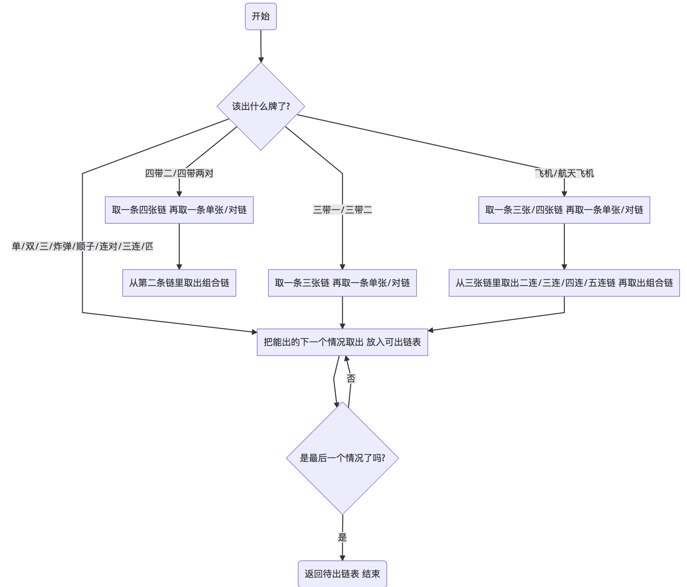

# 一个斗地主人工智能的设计与实现

## 摘要

计算机博弈一直是人工智能与机器学习重要的领域，国内外已经有各种机器博弈在棋类游戏中的应用，但是大部分牌类游戏由于具有非完备性的特殊之处，计算机博弈相关研究不如棋类丰富，而且大多集中在国外游戏德州扑克上，研究起源于中国且风靡全国的游戏——斗地主的计算机博弈的不多。本文介绍了基于博弈树的斗地主人工智能系统的设计与实现，描述了斗地主游戏人工智能的设计思路和实现方法。本系统使用极大极小值搜索算法，并用蒙特卡洛抽样算法解决游戏的非完备性问题。经过测试，本系统在出牌速度及胜率结果上都取得了较好的效果。

**关键词：**计算机博弈；斗地主；人工智能；博弈树搜索；蒙特卡洛算法

## 1 绪论

### 1.1 课题背景与意义

近年来，随着移动网络和智能终端的迅速兴起，手游越来越成为现代人消遣娱乐的重要方式。斗地主作为风靡全国的纸牌类游戏，在实现与智能终端的结合后，更是受到多层次年龄段用户的欢迎，越来越多的玩家使用手机玩斗地主游戏。

然而斗地主手游也存在着一些问题。斗地主手游存在的问题之一就是，在网络对战中，有时会出现玩家掉线的情况，这时，其他玩家的游戏体验就会受到很大影响，此时，如果能够有和人类玩家打牌能力相匹配的人工智能代替掉线的玩家继续游戏，其他玩家的游戏体验就不会受到很大影响。斗地主手游存在的另外一类问题就是，有时，玩家想进行斗地主的游戏，但是因为种种原因凑不够三个人，无法开局，这时，同样地，如果能够有斗地主人工智能的参与，那么无论是否能够找到同伴，都可以随时开始斗地主游戏，并且节省了想玩斗地主的用户搜寻同伴的时间。

由此可见，斗地主人工智能的开发能够一定程度上解决斗地主手游中存在的玩家意外掉线、玩家不足等问题，可以节省用户的搜寻成本，从而提升用户的游戏体验。

因此，本研究旨在利用人工智能中机器博弈的技术，构建一个斗地主的人工智能系统，使其出牌能力和人类相当，从而代替人类进行斗地主游戏，解决斗地主手游存在的玩家掉线、玩家匹配问题，从而帮助玩家节省搜寻的交易成本，可以提升用户的游戏体验。在计算机和手机游戏飞速发展的当今社会，高水平的博弈游戏软件容易获得相当可观的商业价值；另一方面，本研究进一步开发了基于博弈树搜索技术的机器博弈的搜索技术，因此，本研究的成果在未来可应用于其他参与者的行动具有先后次序的动态博弈中，比如股票最优投资决策、交通出行最优路线选择等，从而帮助人们进行更有效和优质的决策，随着研究的不断深入，除了游戏 AI，机器博弈将应用于诸如医学分析、交通管理、军事战略、企业发展等各个领域，可能极大改变人类的生活。

本研究设计开发的斗地主人工智能系统还具有一定的理论意义。现有机器博弈的牌类游戏研究应用大多基于完备信息， 也就是说，机器除了知道自己的牌，也知道其他玩家的牌，很显然，这样的研究具有较大的局限性。而本文基于信息的不完备性，采取蒙特卡洛抽样方法，也就是说，机器所拥有的手牌信息时有限的，并不知道其他玩家的手牌，只知道自己的手牌，知道当前牌局已经打出什么手牌。扑克牌一共有 54 张，这是已知内容， 那么剩下的牌有哪些、其他两名玩家每人手里有几张牌，都是确定的，从而，基于这些已知内容，可以对其他玩家手牌所有可能的情况进行穷举。但是穷举往往需要消耗大量时间空间，在大部分情况下甚至是不现实的，这就用到了蒙特卡洛抽样的方法。依据玩家是否抢地主，是否打出炸弹牌，可以判断该玩家手牌质量是高是低；依据前面回合该玩家是否要不起，可以判断该玩家是否一定没有某种牌型。依据上面的分析可以给穷举出的所有牌组情况加上不同的权值， 再对这些所有情况抽样分析，即可解决其他玩家手牌未知的问题。本研究所应用基于信息的不完备性的蒙特卡洛抽样方法具有更强的现实适应性，对于以往研究中的完备信息博弈具有一定的理论补充意义。

### 1.2 国内外研究概况

游戏 AI 与机器博弈一直是国内外计算机从业人员重点研究的对象。著名学者冯·诺伊曼、香农教授以及著名的计算机学家图灵教授都做过相关研究。近年来计算机硬件发展进步很快，这使得许多关于机器博弈的理论可以得到实现。

2017 年举世瞩目的围棋人机大战中，谷歌公司开发的人工智能系统AlphaGo 和世界第一人类棋手对战取得 3-0 完胜的战绩。围棋下点极多，分支大大多于其他游戏，而且每次落子对棋局的影响时好时坏，AlphaGo 取得了这样的成绩，可以说机器博弈已经取得了很大的发展成就。

具体到棋牌类游戏人工智能系统的设计上来说，近年来，国内有各种不同棋类和牌类游戏的人工智能系统设计与实现。如基于QT的黑白棋游戏开发里==基于QT的黑白棋游戏程序设计与实现==，其作者设计的黑白棋游戏人机对战模式就包括人工智能系统。然而黑白棋规则简单，且该系统仅仅向下预测一步，并无参考意义。再如六子棋计算机博弈关键技术研究里，作者借鉴比特棋盘的思想，提出了一种适用于六子棋的改进后的比特棋盘。作者使用改进的数据结构，快速判断各种棋型。作者深入地研究了各种Alpha-Beta搜索及改进技术后，通过编程实现了这些算法，并比较了六子棋博弈程序中这些算法间的性能差异。作者还通过分析搜索算法的工作过程，并结合六子棋走法生成的特殊性，提出了将走法生成模块中的预置表与搜索引擎中的置换表融合在一起的改进措施，极大地避免了在搜索过程中频繁地生成走法。==六子棋计算机博弈关键技术研究==在更加复杂的中国象棋博弈应用研究中，==基于Android系统的中国象棋人机博弈的应用研究==的作者重点介绍了计算机博弈系统的搜索算法，包括基础的极大极小算法、alpha-beta算法以及高级搜索算法比如PVS、静寂搜索以及空着裁剪等，并通过分析表明着法顺序会影响对博弈树结点的搜索。

现有研究虽然对机器博弈的人工智能进行了一定研究并取得了一些成果，但仍然存在以下两方面的主要问题：一方面，现有机器博弈的牌类游戏研究应用大多基于完备信息，大部分牌类游戏和棋类游戏最大的区别在于，棋类游戏往往是完全公开的。比如象棋，对弈双方都知道自己和对方剩余哪些棋子，每个棋子落在棋盘的哪个位置，但是斗地主游戏中，每名玩家都不知道其他玩家手里有什么牌。正是由于这种信息的不完备性，无法确定博弈树的下层有哪些结点， 使得博弈树的构建遇到困难，这在现实应用中具有较强的局限性，因为很显然， 一个“全知全能”的玩家在博弈中是不受其他玩家欢迎的；另一方面，现有机器博弈的人工智能系统大多需要进行繁重的数据集学习和训练，可移植性较差，不利于研究成果的推广与应用。

基于此，本研究希望从以下两方面为基于博弈的人工智能作出理论和现实方面的贡献，一方面，本研究将试图解决信息的不完备性，采取蒙特卡洛抽样方法，使得机器可以依据自己的手牌、其他玩家的出牌情况，对其他玩家手牌的所有可能情况进行抽样，使得机器博弈从完全信息扩展到不完全信息的背景下。另一方面，本研究将基于逻辑层面的博弈树，使用博弈树搜索算法，使得人工智能系统具有较快的反应速度，具有较好的可移植性。

### 1.3 论文主要工作

本研究旨在设计一个斗地主的人工智能系统，使其具有与人类玩家相匹配的出牌能力，从而在某些情境下代替人类玩家玩斗地主游戏，接入网络斗地主游戏和人一起玩斗地主。本文使用博弈树的构建、评估函数打分、极大极小值搜索的方法建立并搜索博弈树。使用蒙特卡洛抽样算法，实现了计算机博弈系统在非完备游戏中的应用。

从游戏主体设计、游戏AI关键算法设计和游戏AI实际对战实验三个部分介绍本研究。斗地主的人工智能系统首先需要游戏主体来读取和识别游戏发给系统的手牌，通过读取手牌内容，依据斗地主的游戏规则确定所有可出牌。这样本系统才能根据情况选取最优出牌策略。游戏主体包括拆分手牌、依据规则打手牌。游戏AI算法包括博弈树设计、评估函数设计和搜索算法设计。在游戏最后本论文设计实验探究本系统的实际对阵情况，并作出图表，得出结论。

### 1.4 论文组织结构

本文接下来的结构安排大致如下：第 1 章为研究绪论，主要介绍国内外研究概况、本研究的理论和现实意义，本研究的主要工作和可能的创新之处，论文的组织结构；第 2 章将介绍斗地主人工智能的主体设计，将从设计目标、设计思路、工作原理、模块构成四方面展开；第 3 章将介绍斗地主游戏人工智能的关键算法设计，主要包括博弈树的建立、评估函数的设计和搜索算法的设计；第4 章将介绍本研究开发的斗地主人工智能的实际对战实验，包括实验环境、实验结果和实验总结三方面；第 5 章将进行全文总结和展望。

## 2 游戏主体设计

### 2.1 设计目标 

在实际的运用场景中，甚至希望玩家可以混淆视听，即其他玩家不知道和他一起玩斗地主的是人还是机器，机器同人类玩家一样拿到游戏系统发出的手牌，通过手牌质量选择叫或者不叫地主，然后按照游戏规则智能出牌，既可以出牌，也可以不出，参与游戏直到游戏结束。完成这样的系统需要大量时间研究和设计，再次本文实现一个简化版的斗地主人工智能系统。

本系统的设计目标是设计一个斗地主的人工智能系统，它可以代替人玩斗地主游戏，也可以接入网络斗地主游戏和人一起玩斗地主。

具体的，它要满足以下功能：

（1）可以读取自己和其他玩家的手牌；

（2）可以依据出牌规则正确出牌；

（3）具有一定的牌力。

### 2.2 设计思路

想让机器像人一样完成斗地主游戏主要有以下两种设计思路：一是让机器学会打牌的逻辑，让机器知道什么样的牌能打，什么样的不能打，让他知道什么时候游戏结束，谁赢了，让他知道现在他手上的牌是好是坏。这样，利用计算机高速计算的优点，可以用比人脑快得多的速度预测未来几轮出牌的走势，从中选取一个对自己最有利的作为本次出牌策略。第二种设计思路是基于仿生学建立起来的。人类从呱呱坠地到会玩斗地主游戏经历了学习的过程，人类学习认识不同扑克牌表示的不同含义，人类通过学习学会斗地主的游戏规则，人类通过学习提高自己的打牌水平。人在打斗地主游戏时，不断观察自己的手牌和已出的手牌，判断当前局势并选取对自己最有利的出法出牌。类比到计算机上，让计算机了解出牌规则，把当前手牌和已出牌作为输入，当前局势作为输入，以赢得游戏为目的，把本轮出牌作为输出，利用大量牌局训练计算机，最终也可以让计算机自己学会玩斗地主。本系统采用的是第一种设计思路。

基于以上的设计思路，可以确定系统的基本框架如下：使用合适的数据结构存储手牌、上家和下家的剩余手牌；使用决策树模拟博弈过程，每一次出牌对应决策树的一层；使用评估函数计算每个结点的得分；搜索决策树，找到最优分支，得到解法。

基本框架示意图如图2-1所示。

系统框架已经确定，但还存在如下问题。

1. 首先是对于斗地主这种非全信息公开的博弈，本系统不知道下家手里有什么牌，下家出牌的所有可能是无法穷举的， 即博弈树的下层的结点是不确定的；
2. 其次是博弈树分支多，要想提高胜率需要搜索的深度深，利用哪些搜索算法减少搜索量，提高效率；
3. 最后是如何设计估值函数，使系统打牌的牌力更高。对于游戏非完备性来说，剩余的所有牌都有可能出现在下家的手牌里，因此可以穷举所有手牌，但是会出现很多冗余结点，影响效率，也影响 ai 水平。另外可以根据过往回合下家出不出牌认定他一定没有某种牌。

对于以上问题，本文使用如下方案解决。

1. 使用蒙特卡洛抽样算法解决信息非完备性的问题。穷举的方式费时费力，因此本系统们考虑使用抽样的方法，从所有情况中随机的选择一些情况出来，通过计算这些情况的博弈结果，得出相对更有几率是最优解法的出牌方法作为结果。
2. 对于搜索算法，本文使用极大极小值搜索算法，在博弈树的每一层都使用对自己有利的出牌方法，从而赢得最终的胜利。
3. 对于估值函数来说，有两种实现策略。一种是人工调整，人工根据经验设计参数评判结果的优劣，在对弈中不断调试参数， 使其更优。这种方法非常耗时耗力，但往往能收到不错的效果。另一种是机器学习，使用爬山法、遗传算法、神经网络算法等算法让系统不断与人对弈、与自己对弈，自己调整参数，实现机器学习优化。

对于人类来说，完成一局斗地主游戏需要以下步骤：拿到手牌，对手牌进行观察、排序；通过“抢地主”或“不抢”确认自己“地主”或“农民”的身份；轮到自己出牌时，依据出牌规则、前面玩家出牌情况和自己对局面的判断出牌；等到“地主”或“农民”有一方赢得胜利时，结束游戏。与人类玩游戏类似，人工智能系统完成游戏也需要上面的步骤，只是需要人脑思考的部分，改为计算机依据算法得出最佳出牌。
通过对人类完成一局斗地主游戏的步骤，很容易分析出人工智能系统完成一局斗地主游戏的步骤。下面是人工智能系统完成一局斗地主游戏的步骤：向人工智能系统输入当前游戏发来的手牌，并对手牌进行评估，评估手牌质量，估算手牌所得分数；依据手牌质量和分数确定是否“抢地主”，从而确认自己“地主” 或“农民”的身份；拆分手牌，计算出当前能打出的牌的不同组合；轮到自己出牌时，依据出牌规则选出所有能打出的牌的情况，将这些情况作为结点放入博弈树的一层，对于每个结点，利用蒙特卡洛抽样不断向下展开分支，直到当前子树的叶子结点，确定胜负情况；依据胜负情况确定当前的最优出牌方法，出牌；等到“地主”或“农民”有一方赢得胜利时，结束游戏。

人工智能系统完成一局斗地主游戏的步骤示意图如图2-2所示。

本文采用人工经验设计评估函数，通过计算剩余牌的数量判断牌局是否对自己有利。对于评估函数来说，因为基于手牌分数的算法往往有失偏颇，如最后一个人只剩一张牌，有牌权的时候，不管他手里剩的是什么牌，他都赢了，这是对于他手牌的分数计算就没有意义。但是如果完全基于胜率，利用极大极小值算法。只有建立到博弈树的最后一层才能得出分数，因此博弈树必须完全展开。对于斗地主游戏来说，每结点大约有 20 种出牌方法，博弈树大约几百层，完全展开博弈树将建立无数结点，建立时间、搜索时间都将是及时游戏不能承受的，普通玩家的计算机也没有如此巨大的内存供 AI 程序占用。因此本系统只能基于人工方法设计了评估函数，博弈树的建立层树设为 5 层以内，来兼顾计算时间、内存占用和出牌效果。
如果不能完全展开博弈树，则需要定义评估函数对展开到某一层次的博弈树叶子结点进行评估，评估函数读取结点两方玩家的剩余手牌状态，判断此牌局对自己胜利的影响，从而确定得分。再利用极大极小值搜索算法确定根结点（root）需要选择最优分支，即选择了最佳出牌。
由以上步骤可知，本系统使用到的技术主要有：设计评估函数分析手牌质量；对博弈树的构造和遍历；蒙特卡洛抽样算法；极大极小值搜索算法。
综上所述，本研究的设计思路在于让机器学会打牌的逻辑，从而利用计算机高速计算的优点，选取一个对自己最有利的作为出牌策略。本研究将首先建立系统框架， 实现手牌的拆分，实现博弈树的建立；接下来，本研究将实现极大极小值搜索算法，实现蒙特卡洛抽样；最后，本研究设计实验，使本斗地主人工智能系统与随机出牌的机器出牌系统连续对战多次，计算平均胜率，并针对实验结果做进一步分析和优化。

### 2.3 工作原理

输入当前手牌，让计算机将这些手牌拆分成所有可出的情况，然后将当前情况作为根结点，以每种可能的出牌情况作为子结点，每个子结点代表从当前结点，出了这种牌以后牌局的状态。对于根结点的每个子结点，都在根结点下面一层，因此可以将它们称为第一层结点。第一层的每一个结点都可以看成根结点， 再进行展开，从而得到一棵完整的，代表牌局未来每一个状态的博弈树。博弈树展开到最后会得出游戏结果，农民或地主会取得游戏的胜利，此状态对应的结点为博弈树的叶子结点。
博弈树完全展开后，每个叶子结点对应农民或地主的某一方取得了游戏的胜利。结点和结点之间的路径可以看作父结点的出牌选择。假设某一分支的叶子结点 k 在第 m 层，此叶子结点对应的胜利玩家是 a，a 在第 m-1 层的，k 结点的父结点（k-1）一定会选择通向胜利的（k）来作为他的选择，如果他不那样选， 选择其他出牌方法都对自己不利，这是显而易见的。因此本系统们可以认为，对于轮到 a 出牌的结点 k-1，一定意味着 a 胜利。逐层向上回写，可以得到根结点root对应的所有结点的胜负情况。这时可以选取通往胜利的结点。
但在实际情况中，如果每次有 20 种出牌方法，共有几百层结点，整个博弈树就有几乎无数个结点，因此建立完整个博弈树往往是不可能的。但是不建立完博弈树，就得不到最终的结果。因此这里用到评估函数。评估函数顾名思义，意思是评估一个状态的优劣。以斗地主为例，在一局游戏没有进行到最后的时候， 用评估函数来计算当前状态的好坏。以此给博弈树中的所有结点状态打分。因为上文提到的原因无法完全遍历博弈树，只能将博弈树展开到一定层次，用评估函数来给最后一层的结点及其他层的叶子结点状态打分，认为分数越高越容易赢。再用极大极小算法层层回写，找出最容易赢的选择。

### 2.4 模块构成

本系统主要由游戏主体循环模块、拆牌模块和打牌模块组成，模块组成示意图如图2-3所示。

完成斗地主游戏最重要的两个部分就是拆牌和打牌。本节将详细介绍这两个主要模块：打牌模块和拆牌模块。

#### 2.4.1 打牌模块

先介绍打牌模块。打牌模块主要为 zidong() 函数。

打牌模块通过一个不断循环的 while 语句不断接受游戏或手动传送过来的出牌信息，根据不同的信息选择进入不同的分支。在收到其他玩家出牌后，从手牌库里减去其他玩家的出牌，得到新的剩余牌库，然后继续接收游戏出牌信息； 接收到游戏结束的信息时，退出 AI 进程；接收到出牌信息时，从出牌缓存中读取当前手牌信息，将手牌拆分成所有可以出牌的情况，每种出牌情况作为一个分支结点，建立博弈树，然后再针对当前结点的每个子结点递归地建立博弈子树， 直至建立到规定的层树或子分支游戏结束。再利用评估函数对每个叶子结点打分，利用极大极小值搜索算法递归地层层回写，最终得到根节点下面每个分支的打分，从中选择最优的作为本次出牌方案。

伪代码如下：

def zidong():

sigbb = 输入谁是地主

初始化手牌

while True:

if loop % 3 == 0: # loop 为轮数，判断该谁出牌

for i in range(MTTIMES): # MTTIMES 为蒙特卡洛抽样次数随机一个下家和上家的手牌

准备出牌，进入博弈树的建立统计蒙特卡洛抽样结果

确定出什么牌出牌然后更新牌库

elif loop % 3 == 1: # 下家出牌输入下家出牌然后更新牌库else: # 上家出牌

输入上家出牌然后更新牌库

loop += 1

在评估函数给叶子结点打分后，极大极小值搜索函数从根节点（root）进入， 读取当前输入结点的每个子结点的分数，如果没有分数，则递归地将 root 结点的第一个子结点作为输入，直到读取到输入结点的每个子结点有分数为止。这时，需要做的是针对所有子结点的得分，得出本输入结点的得分。由于评估函数设计为分数越高，本系统越容易赢，因此在每一层结点上，本系统和本系统的友方玩家选择最容易使本系统赢的结点（得分最高的结点），本系统的敌方玩家选择最容易使本系统输的结点（得分最低的结点）。这便是极大极小值搜索算法的关键所在。这样选择合理的原因是，对于本系统和本系统的友方玩家来说，本系统们选择得分最高的结点，让本系统们更容易赢是合情合理的；对于本系统的敌方玩家来说，假如他不选择此时得分最低的结点，那么本系统将更容易取得接下来游戏的胜利，因此可以说，不论敌方玩家是否选择得分最低的结点作为他的选择，本系统利用极大极小值搜索得出的结果都是最优的。

下面按照一局游戏的实际体验流程介绍本模块。使用手机游戏“腾讯欢乐斗地主”，开始一局新游戏，并开始运行本系统的 zidong() 函数。sigbb 用来存储谁是地主。initcards() 函数初始化手牌和剩余牌。欢乐斗地主发给本系统一副手牌，在initcards 函数中将手牌写入 str 中，输入格式为：3 4 5 6 7 8 9 10 J Q K A 2 小王大王分别对应 3 4 5 6 7 8 9 0 j q k a 2 x d。

程序内使用列表存储手牌。

例如表示全部 54 张牌：examplelist= [4, 4, 4, 4, 4, 4, 4, 4, 4, 4, 4, 4, 4, 1, 1]

examplelist[0] 表示扑克牌 3 4 表示这张 3 有 4 张。列表元素从 0-14 分别代表 3 4

5 6 7 8 9 10 J Q K A 2 小王大王。

再如某手牌为 handc = [2, 2, 0, 0, 0, 0, 0, 0, 0, 0, 0, 0, 0, 1, 0]，则代表此人有两

张 3 两张 4 和一张小王。

表格说明如表 2-1所示。

表 2-1   手牌与输入字符、列表序列数对应表 

| 手牌 | 对应输入字符 | 对应列表序列数 |
| ---- | ------------ | -------------- |
| 3    | 3            | 0              |
| 4    | 4            | 1              |
| 5    | 5            | 2              |
| 6    | 6            | 3              |
| 7    | 7            | 4              |
| 8    | 8            | 5              |
| 9    | 9            | 6              |
| 10   | 0            | 7              |
| J    | j            | 8              |
| Q    | q            | 9              |
| K    | k            | 10             |
| A    | a            | 11             |
| 2    | 2            | 12             |
| 小王 | x            | 13             |
| 大王 | d            | 14             |

 输入完手牌以后，利用循环把手牌转换为列表，存储到 handc 列表中，再用全部牌按元素相减，得到剩余牌并返回。接下来，在 zidong 函数中，进入 while 循环，用 loop%3 来判断该谁出牌。例如 sigbb 为 1 的时候，loop 初值为 0，那么loop%3 也为 0，系统就知道是该本系统出牌了，每轮出牌后，都执行 loop=loop+1 的操作，因此系统可以让本系统、下家、上家轮流出牌。在轮到本系统出牌时，使用 svbmiu 和 gfpl 两个函数出牌。介绍这两个函数前先要介绍 ijb 变量。ijb 用于控制电脑确认是否可以随便出牌。

例如图 2-3所示流程：

上家出了 55，本系统需要出比 55 大的牌（比 55 大的对子或炸弹）。但如果是这种情况，如图 2-4所示流程：

下家、上家都没有出牌，因此本系统可以出任意牌型。本系统使用 ijb 变量判断每种情况。ijb 初值设一个很大的值（如 999），每当有人出牌了，就将它设为 0，每当有人没出牌就让它加 1。只有本系统出了牌，下家、上家均 pass 时本系统才随便出，因此ijb>=2 的时候本系统可以随便出牌。如果 ijb 为 0 或者 1 代表上家或下家出过牌，需要本系统跟牌。随便出的函数为 svbmiu（随便出的搜狗双拼，下同），跟牌的函数名为 gfpl。

svbmiu 接收 3 个参数，分别是本系统的手牌、下家的手牌和上家的手牌。而斗地主作为非完全博弈，电脑是不知道其他玩家有什么牌的。但是扑克牌一共有54 张，每回合每个人出了哪些牌都是确定的，因此知道其他两名玩家分别有几张牌，也知道其他两名玩家手里一共有哪些牌。但是建立博弈树需要知道每名玩家的牌，这里用到了蒙特卡洛随机算法。使用 svjipl 函数输入剩余牌列表，输入下家和上家的手牌，返回一个随机的牌组结果。

例如剩余牌列表为 [2, 3, 1, 0, 0, 0, 0, 0, 0, 0, 0, 0, 0, 0, 0]，下家剩余 3 张牌，上家剩余 3 张牌，一个随机的牌组结果为下家 [1, 2, 0, 0, 0, 0, 0, 0, 0, 0, 0, 0, 0, 0,0]，上家 [1, 1, 1, 0, 0, 0, 0, 0, 0, 0, 0, 0, 0, 0, 0]。利用这个随机的牌组结果计算后文的出牌函数，得到最佳出牌结果，重复随机多次，选出出现次数最多的出牌作为最后决策。如某局游戏中，设定重复随机 10 次，最终计算得到的出牌结果列表如下：[” 出 33”,” 出 33”,” 出 33”,” 出 33”,” 出 33”,” 出 44”,” 出 55”,” 出 66”,” 不出”,” 出 33”]，则选择出现次数最多的” 出 33” 作为最后决策。

svjipl 函数使用 random 包中的 sample 函数，假设下家剩余 m 张手牌，则从剩余牌中任选 m 个作为下家手牌，其余牌作为上家手牌。

至此，已经有了三家手牌，可以出牌了。下面介绍两个出牌函数：svbmiu 函数和 gfpl 函数。svbmiu 函数输入三家手牌。先建立博弈树根结点，然后建立博弈树，再使用评估函数给结点打分，最后从博弈树的第一层挑出评分最高的结点（最佳选择）出牌。博弈树的建立、评估函数设计以及搜索算法的设计见第三章。出牌先要知道可以出什么牌。0 1 2 3 4 格式存储的手牌先要使用 chaipai 函数拆牌，转换为其他形式。这里使用了字典里嵌套列表的形式，比如某次拆牌的结果：

’djvh’: [0, 1, 2, 3, 4, 5, 6, 7, 9, 10, 12],

’dvzi’: [1, 2, 4, 5, 6, 7, 9],

’sjvh’: [6, 9],

’vadj’: [],

’upzi’: [(0, 4), (0, 5), (0, 6), (0, 7)],

’lmdv’: [(4, 6), (4, 7)],

…

’sjdlyi’: [(6, 0), (6, 1), (6, 2), (6, 3), (6, 4), (6, 5), (6, 7), (6, 9), (6, 10), (6, 12), (9,

0), (9, 1), (9, 2), (9, 3), (9, 4), (9, 5), (9, 6), (9, 7), (9, 10), (9, 12)],

’sjdlor’: [(6, 1), (6, 2), (6, 4), (6, 5), (6, 7), (6, 9), (9, 1), (9, 2), (9, 4), (9, 5), (9, 6),

(9, 7)],

…

’wulmfzji’: [],

’hhtmfzji’: [],

’hhtmfzji2’: [],

’hhtmfzji3’: []

本系统的手牌为 [1, 2, 2, 1, 2, 2, 3, 2, 0, 3, 1, 0, 1, 0, 0]，字典关键字与牌型的关系如表 2-2所示。

表 2-2   字典关键字与牌型的关系

| 关键字    | 牌型         | 牌型举例                        |
| --------- | ------------ | ------------------------------- |
| djvh      | 单张         | 3                               |
| dvzi      | 对子         | 33                              |
| sjvh      | 三张         | 333                             |
| vadj      | 炸弹         | 3333、4444 或王炸（大王、小王） |
| upzi      | 顺子         | 34567                           |
| lmdv      | 连对         | 334455                          |
| sjlm      | 三连         | 333444                          |
| silm      | 四连         | 33334444                        |
| sjdlyi    | 三带一       | 3334                            |
| sjdlor    | 三带二       | 33344                           |
| sidlor    | 四带二       | 3333 45                         |
| sidllddv  | 四带两对     | 3333 4455                       |
| orlmfzji  | 二连飞机     | 333444 56                       |
| orlmfzji2 | 二连飞机对子 | 333444   5566                   |
| sjlmfzji  | 三连飞机     | 333444555 678                   |
| sjlmfzji2 | 三连飞机对子 | 333444555   667788              |
| silmfzji  | 四连飞机     | 333444555666   789Q             |
| silmfzji2 | 四连飞机对子 | 333444555666   778899QQ         |
| wulmfzji  | 五连飞机     | 333444555666777   89QKA         |
| hhtmfzji  | 航天飞机     | 33334444 5678                   |
| hhtmfzji2 | 航天飞机对子 | 33334444   55667788             |
| hhtmfzji3 | 三连航天飞机 | 333344445555   6789QK           |

例如 djvh 对应的列表里包含 0，依据前表的对应关系，说明可以出单张 3。再如 sjdlyi 对应的列表里包含 (6,0)，说明可以出三带一 9993。

#### 2.4.2 拆牌模块

下面介绍拆牌模块。观察斗地主游戏中允许出的所有情况，分析得知可出牌的元素有四种，分别是：单张、对子、三张和四张。比如连对  334455，由对3、对 4 和对 5 组成。再如二连飞机 33344456，由三张 3、三张 4、单张 5 和单张 6 组成。因此想拆牌，先拆出 4 种元素。为了拆出四种元素，定义了 findfirst 函数。findfirst 函数输入手牌，元素数，返回这种元素列表。findfirst(handc,2) 则返回了 handc 中所有的对子。返回结果为 [1, 2, 4, 5, 6, 7, 9]。元素列表建立完成以后开始找顺子。findshun 函数用于找顺子；findxdx 函数用于找三带一、三带二等；findfzji 函数用于找飞机。这些函数均使用元素拼接，加入到不同列表里返回，在此不一一赘述。
拆牌流程图如图 2-5 所示。

chaipai 函数返回的结果包含许多空项，使用 checkhandsdict 函数来把他们去掉。下面是去掉后的结果：
’djvh’: [0, 1, 2, 3, 4, 5, 6, 7, 9, 10, 12],
’dvzi’: [1, 2, 4, 5, 6, 7, 9],
’sjvh’: [6, 9],
’upzi’: [(0, 4), (0, 5), (0, 6), (0, 7)],
’lmdv’: [(4, 6), (4, 7)],
’sjdlyi’: [(6, 0), (6, 1), (6, 2), (6, 3), (6, 4), (6, 5), (6, 7), (6, 9), (6, 10), (6, 12), (9,
0), (9, 1), (9, 2), (9, 3), (9, 4), (9, 5), (9, 6), (9, 7), (9, 10), (9, 12)],
’sjdlor’: [(6, 1), (6, 2), (6, 4), (6, 5), (6, 7), (6, 9), (9, 1), (9, 2), (9, 4), (9, 5), (9, 6),
(9, 7)]
至此，pushcarddict 里包含所有可以出的情况。

## 3 游戏 AI 关键算法设计

 

本章详细介绍人工智能模块设计思路、算法及实现。第一部分介绍博弈树的建立与手牌的拆分；第二部分介绍评估函数的设计与实现；第三部分介绍搜索算法设计与实现。

 

### 3.1 博弈树的建立

下面介绍博弈树的建立。博弈树的建立在函数 gen_game_tree 中。函数输入一个结点，并以此结点作为根结点，建立博弈树的下一层子结点。建立好以后，再递归的对刚刚新加的所有结点调用 gen_game_tree 函数，从而建立完整博弈树。

博弈树建立流程图如图 3-1所示。

每个结点都是一个 DTree 类，类的定义如下：

class DTree(object):

def init (self, iupltype, iuplvalue, ugyupl, player, value=-1, buiu=0, level=0, score=0):

self.iupltype = iupltype self.iuplvalue = iuplvalue self.ugyupl = ugyupl self.player = player

…

每个结点都包含如表 3-1 的全部属性。

表 3-1 结点属性表

|属性名|描述|
|---|---|
|iupltype    |                                            到此结点的出牌类型|
|iuplvalue                  |                              到此结点的出牌值|
|ugyupl                     |                              当前手里的剩余牌|
|player                     |                               下一个出牌的玩家|
|value                      |                                   游戏结束标志|
|buiu                        |                             到此结点的不出标志|
|level                        |                                    博弈树深度|
|nodes                   |                                此结点的字结点列表|
|score             |                                         此结点的评估分数|

下面举例介绍，如图 3-2所示。

对于 a 结点来说，到 a 结点的出牌为“不出”，它的 iupltype 属性和 iuplvalue 属性均承接 root 结点的值，它的 buiu 属性为 root 结点的 buiu 属性值加一。这样做有许多意义。在斗地主游戏中，如果我出了牌，下家和上家都 pass，则我可以继续出牌，且可以出任意牌型。如果我出了牌，下家或上家中有一个人 pass，一个人跟了牌，则我需要跟上家或者下家出的牌型出牌，但是这时会出现一个问题：对于图示的 a 结点来说，到 a 结点的出牌为“不出”，如果它不承接 root 结点的值，它的下家就不知道要跟什么牌了。如果上家和下家都 pass，我可以任意出牌，因此我需要每次有人不出时，buiu 属性加一，这样我就知道在这条路径上有多少次“不出”存在，也就可以判断自己是应该跟牌还是随便出了。ugyupl 属性用于保存牌局状态，从而知道目前自己还有多少张牌、以及这些牌分别是什么。

player 属性用于保存下一个出牌的玩家是谁。value 用于保存牌局是否结束。判断牌局是否结束的标志就是经过此次出牌以后，此结点对应的出牌者是否把牌出完了，即他是否赢得了游戏的胜利。level 属性用于保存当前深度，这在调试中非常有意义。nodes 列表保存了子结点，是树的结果的关键属性。分数属性保存了评估函数给结点的打分。

### 3.2 评估函数设计

斗地主游戏是一个以剩余牌定胜负的游戏。最先出完牌的玩家获胜。因此我在设计评估函数时主要以剩余牌的数量作为评分依据。judge 函数用于给结点打分。它的伪代码如下：

def judge(cards):

分数 = 200

每有一张手牌: 分数 -= 10

return 分数

由伪代码可以得出，我设定的满分为 200 分，这是因为一个人最多有 20张手牌，这样规定分数不会为负数。每有一张手牌分数减 10。

这样的评估函数简单明了，但是有一个问题：有时玩家手里只有一张很小的牌，我的系统会给他很高的分数（190 分），但是如果他没有牌权，这一张牌将永远无法打出。因此他的分数不应该很高；还有一些情况，比如某玩家有一个超大飞机，一下子可以把牌打完，按照这种评估策略他的分数却很低。因此我的评估函数还有很大改进空间。

### 3.3 搜索算法设计

本部分介绍搜索算法，并着重介绍本系统采用的算法。

在具有完全信息的双人游戏中，基于极小极大的全局搜索方法非常成功。已经在一些热门游戏中达到了世界冠军级别。 在国际象棋以及使用逆向分析构建的跳棋，搜索游戏残局数据库可以很有效的解决问题。但是对于斗地主这种非完备信息的博弈，博弈树展开时就出现了不同随机牌组的完全隔离的树。这样继续搜索将会使耗费时间成倍增长。在斗地主这种非完备信息的博弈中，牌局状态千变万化，即使两次牌局状态完全一致，本系统手牌也一致，由于系统的非完备性，其他玩家的牌仍然是未知的。因此如果建立斗地主残局数据库，不但状态难以表示、数据量庞大，而且结果往往不是很好。

综上所述，本系统使用极大极小值算法，不建立斗地主残局数据库。极大极小值算法是一种算法，它在最小值中找出最大失败可能性（即最小化对手的最大收益）。它通常以递归形式实现。该算法是一种零和算法，其中一方选择可用选项中最大化其优势的选项，另一方选择最小化对手优势的选项。其输赢总和为0（有点像节能，就像两名球员本身有1分，最终输家将给予1分给胜者，但总共有2分）。在通常情况下，我们通常希望使用少量搜索为当前情况选择更好的方法。然而，在一场典型的比赛中，对状况的评估往往不像失败，练级或获胜那么简单。在输赢游戏中，有优点和缺点。换句话说，我们必须用更详细的方法来描述情况的利弊，而不是仅仅用1，-1,0这三个数来描述这三种结局情况。假设我们有一个函数可以评估每种情况的优点。例如，A赢是正的，B赢是无限的，并且可能性是0;其他情况是基于剩余棋子的数量和位置以及从负无穷到正无穷的具体得分。这样，我们可以建立一个固定深度的搜索树。其叶节点不一定处于最终状态。它们只是固定深度的最深节点。它们的值由上述函数评估。对于中间节点，如前所述，A方取子节点的最大值，B方取子节点的最小值。这个分数的功能被称为静态评估函数来取代固定深度搜索。显然，我们不能有绝对精确的静态估计函数。否则，只要这个静态评估函数可以解决所有的游戏。评估函数只给出一个粗略的评级。在此基础上，所执行的小搜索的可靠性在理论上不如前述的三态游戏树，但是该方法是可实现的。使用特定知识构建评估函数称为启发式搜索。评估函数也成为一些文献中的启发函数。

本系统在给博弈树建立完成后（或建立到某一最大层数后）给全体叶子结点利用 judge 函数打分，但此时 root 结点的子结点并没有得分。这时需要搜索算法来将他们的分数计算出来。本系统递归的层层向上回写结点得分。主要策略是：和我一队的玩家和我都希望我的得分越高越好，因此使用 max 值；和我不一队的玩家希望我的得分越低越好，因此使用 min 值。回写到 root 结点的下一层时，选取得分最高，也就是对我最有利的出牌方式出牌。

## 4 游戏 AI 的实际对战实验

本章主要介绍系统在实际对战中的运行情况，让本系统与随机出牌的电脑对弈，通过实验得出本系统的实战水平，并做进一步优缺点分析评估。

### 4.1 实验环境

实验环境为 Ubuntu 16.04.4 LTS，Python 3.5.2。

### 4.2 实验步骤

本文设计实验试图测试本系统玩斗地主游戏时的牌力。为了简便起见，本文每次都让本系统当地主，每次开局都随机发牌，两个农民都都采用随机但按游戏规则出牌的机器，在博弈树搜索深度分别为 3 层和 4 层时连续游戏6000局。实验分为随机发牌、随机出牌、游戏主体和结果展示四个模块，模块示意图如图4-1所示。

下面分模块介绍实验步骤。

#### 4.2.1 随机发牌模块

本模块函数名为randomcard。函数先建立三个玩家的手牌列表，并置为空，结果如下表所示。列表说明见第二章。

| 玩家 | 手牌列表                                                       |
| ----------- | ---------------------------------------------------------- |
| 本系统 | [0, 0, 0, 0, 0, 0, 0, 0, 0, 0, 0, 0, 0, 0, 0] |
|          上家   |      [0, 0, 0, 0, 0, 0, 0, 0, 0, 0, 0, 0, 0, 0, 0]                                          |
|          下家   |  [0, 0, 0, 0, 0, 0, 0, 0, 0, 0, 0, 0, 0, 0, 0] |

本模块的目的是让本系统获得20张牌，上家和下家各获得17张牌，三名玩家把总共的54张牌全部分完，而且分法是完全随机的，并将结果保存到三个人的手牌列表中。

为了解决这个问题，本系统采取了编号的方法。给54张扑克牌从0-53依次编号，0-51分别为四种花色的A到K，52、53号卡牌分别为小王和大王。将54张牌编号完毕后，利用random.sample函数随机一个0-53的排列。

举个例子来说，某次使用random.sample函数随机了一个排列，它的排列为

接下来，使用

### 4.3 实验结果

如图 4-1 、图 4-2所示，分别为博弈树搜索深度为 3 层和 4 层的情况。

图 4-1 搜索深度为 3层时胜率图

第二局失败，胜率掉到了 50%。搜索深度为 3 层时，可以看到游戏进行到 5000 局时曲线已经非常收敛，胜率稳定在 72.85%。

图4-2 搜索深度为4层时胜率图

如图所示，搜索深度为 4 层时，可以看到游戏进行到 5000 局时曲线已经非常收敛，胜率稳定在 73.38%。

### 4.4 实验结论

游戏局数进行到 2000 以后逐渐收敛，到 5000 局时已经完全收敛，验证了系统的正确性。也可以确定系统的牌力如何。

搜索深度为 4 层时比搜索深度为 3 层时胜率提高了 0.53%，提高率为 0.7%。可以看出搜索深度越深，胜率越高，验证了系统的正确性。

和随机出牌的机器对战，胜率可以稳定在 73% 作用，说明本系统具有一定

的斗地主出牌水平，但人类玩家对战随机出牌的系统往往胜率在 90% 以上，说明本系统与人类玩家相比仍有一些差距。

## 5 总结与展望

本章总结全文，主要从系统设计、系统实现及实战结果三个方面总结系统的优势和不足，并针对不足提出今后的研究方向。

### 5.1 全文总结

本设计使用博弈树建立、博弈树搜索、评估函数打分等基础机器学习技术， 实现了基于博弈树的斗地主人工智能出牌系统，在实验中和随机出牌的系统对战，取得了 73% 胜率的成绩。本系统的优势在于响应迅速、可移植性强、不需要数据集、不需要训练，且结果较好。

具体地说，本文完成了以下几个方面的内容：

1. 本研究设计了斗地主人工智能的游戏主体，它解决了读取手牌、拆分手牌 和按规则获得可出牌牌型的功能；
2. 本研究设计了游戏AI的关键算法，把游戏主体拆分好的手牌建立成博弈树，并通过设计评估函数和搜索算法找出最优的出牌方法；
3. 本研究还设计了实验，将本系统和随机出牌的机器作对比，得出了较好的实验结论。

本研究可能的创新之处在于以下两个方面：一方面，本研究将机器博弈从完全信息扩展到不完全信息的背景下。现有机器博弈的牌类游戏研究应用大多基于完备信息，而这在现实应用中具有较强的局限性，因为很显然，一个“全知全能”的玩家在博弈中是不受其他玩家欢迎的， 而本文基于信息的不完备性，采取蒙特卡洛抽样方法，使得机器可以依据自己的手牌、其他玩家的出牌情况，对其他玩家手牌的所有可能情况进行穷举，并对穷举出的所有牌组情况赋予不同的权重，再对这些所有情况抽样分析，从而在一定程度上解决了不完全信息背景下的机器博弈问题，具有更强的现实适应性。

另一方面，本研究具有较强的可移植性。本研究开发的斗地主人工智能不需要进行繁重的大量数据集的学习和训练，从而具有较快的反应速度，具有较好的可移植性。

### 5.2 展望
由于时间有限，本系统还有许多可以改进的地方。
1. 一是没有对博弈树进行剪枝操作。博弈树建立时会有许多将来”无人问津“的冗余结点，在博弈树建立时及时对其进行”剪枝“操作，可以减少不必要 的计算，从而使计算速度加快。一般的，可以在相同时间内使得搜索深度加倍。这对于提高胜率很有帮助。
2. 二是博弈树建立好后没有重用。本系统每遍历到一个新结点，都针对此结点重新建立博弈子树，实际上，这些建立有重复的部分， 可以在已有的博弈树基础上生成。这也可以减少博弈树生成时间。
3. 三是评估函数完全由剩余牌的数目决定，对于类似玩家手里只有一张很小的牌，我的系统会给他很高的分数这样的情况，并不合适，还有改进空间。

对于上述改进空间，我提出如下解决思路。

1. 对于博弈树的剪枝操作，可以利用阿尔法-贝塔剪枝算法，给博弈树去掉冗余的分支，在相同时间内使得系统可以建立、搜索到更深层次。
2. 对于博弈树重用的问题，可以重构博弈树建立的代码，使得博弈树建立与结点独立出来，保存在另一个地方，每次建立新结点都去同一棵树里构建，而不是创立一棵新的树。
3. 对于评估函数的设计问题，可以给手牌加上不同的权重，让系统同时根据牌型和剩余牌数量判断手牌好坏，从而优化博弈树的搜索，使得系统牌力更上一层楼。

## 致谢

时光飞逝，转瞬间，大学四年就走到了最终章。这四年来，我成长了许多。

在这里，我要感谢华中科技大学计算机学院的各位老师，是他们赋予了我丰富的知识；感谢我的导师谢美意老师，为我提供了无私和有价值的指导和帮助， 使我能够顺利完成论文设计和写作；感谢我所在的艺术教育中心键盘队，为我提供了巨大的施展才华的舞台，值得我终生怀念；感谢姜丹老师对我的栽培和鼓励，使我在担任华中科技大学艺术教育中心键盘队队长期间极大的提升了自己的组织、协调、领导能力；感谢支持我的父母、亲人和朋友，为我提供鼓励和帮助；更要感谢我的女朋友，感谢多年来的陪伴与鼓励，更感谢无私的付出。
